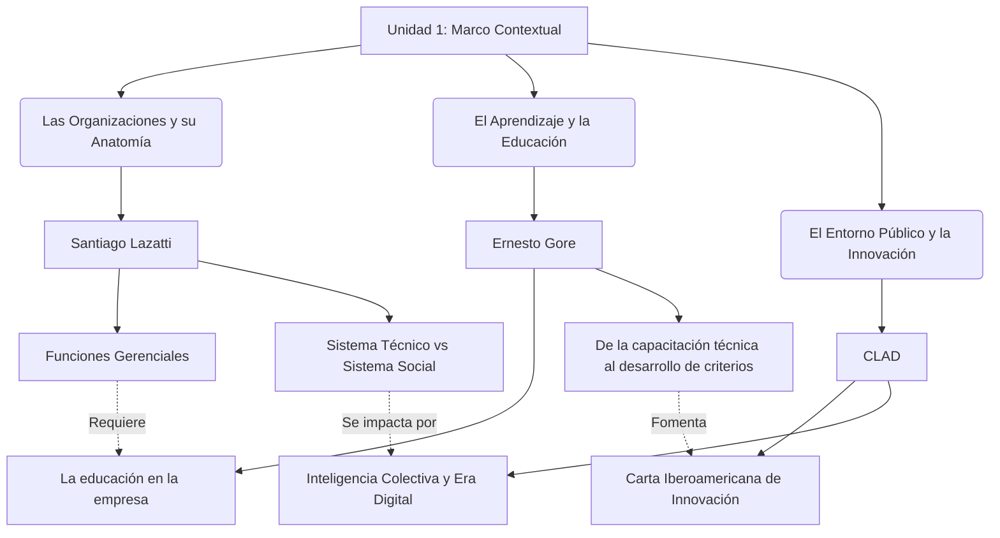
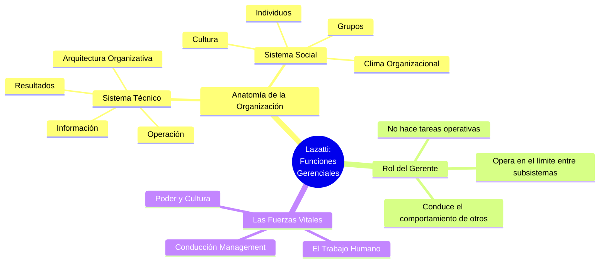
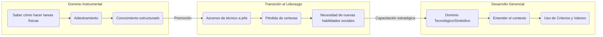
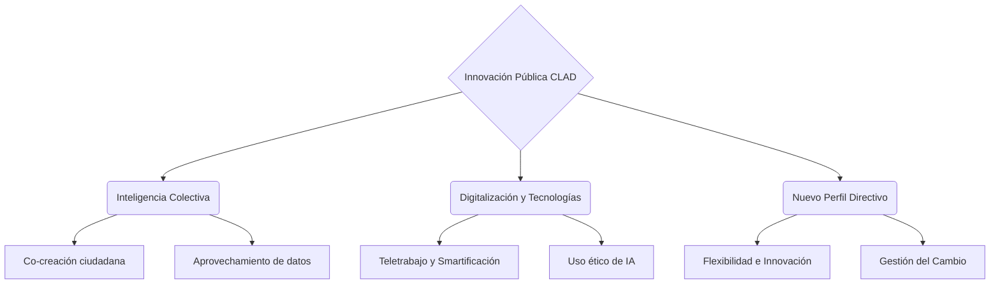

# Infografías - Unidad 1: Marco Contextual del Desarrollo Gerencial

A continuación se presentan los diagramas visuales (infografías) para la Unidad 1, basados en los apuntes detallados.

## 1. Infografía Integradora de la Unidad 1

Este diagrama muestra cómo se enlazan los textos principales de la unidad en torno al concepto central del Desarrollo Gerencial.

---

## 2. Infografía Particular: Santiago Lazatti (Funciones Gerenciales)

Este mapa mental desglosa la anatomía de las organizaciones y el rol del gerente según Lazatti.

---

## 3. Infografía Particular: Ernesto Gore (La educación en la empresa)

Diagrama de flujo que explica la transición del aprendizaje instrumental al desarrollo de criterios según Gore.

---

## 4. Infografía Particular: CLAD (Carta Iberoamericana de Innovación)

Mapa que detalla los pilares de la innovación pública y la inteligencia colectiva.

