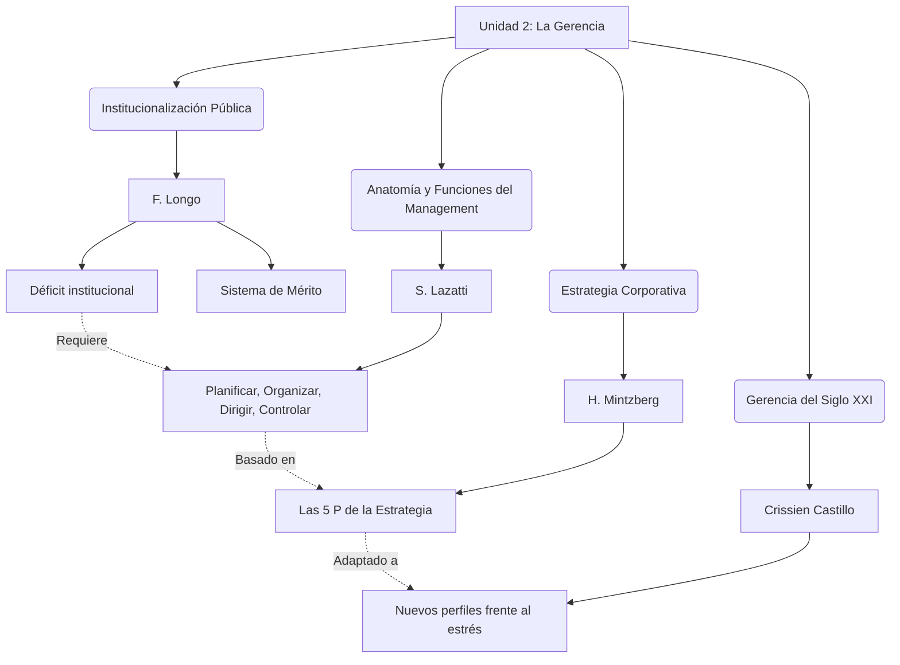
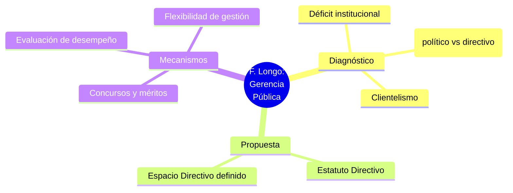
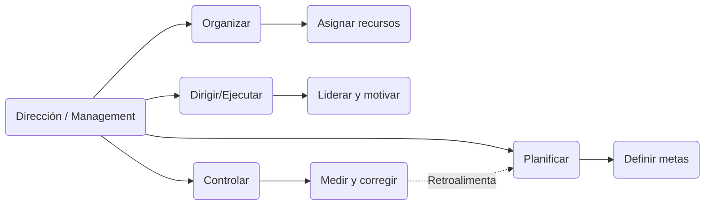
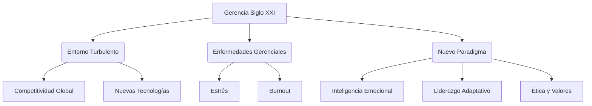
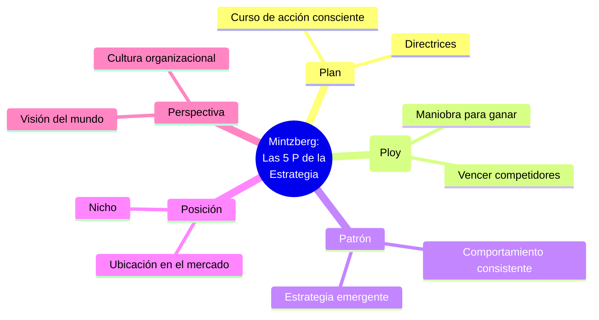

# Infografías - Unidad 2: La Gerencia y sus Funciones

A continuación se presentan los diagramas visuales para la Unidad 2, en base a los resúmenes detallados de Longo, Lazatti, Crissien Castillo y Mintzberg.

## 1. Infografía Integradora de la Unidad 2

Este diagrama muestra cómo se conectan las funciones de la gerencia, los retos del siglo XXI y la perspectiva estratégica.

---

## 2. Infografía Particular: Francisco Longo (Gerencia Pública)

Mapa conceptual sobre la institucionalización de la gerencia pública.

---

## 3. Infografía Particular: Santiago Lazatti (Funciones del Management)

Diagrama sobre el proceso y funciones gerenciales.

---

## 4. Infografía Particular: Crissien Castillo (Gerencia del Siglo XXI)

Flujo de los retos del gerente moderno.

---

## 5. Infografía Particular: Mintzberg (Las 5 P de la Estrategia)

Mapa visual de las 5 dimensiones de la estrategia empresarial.

