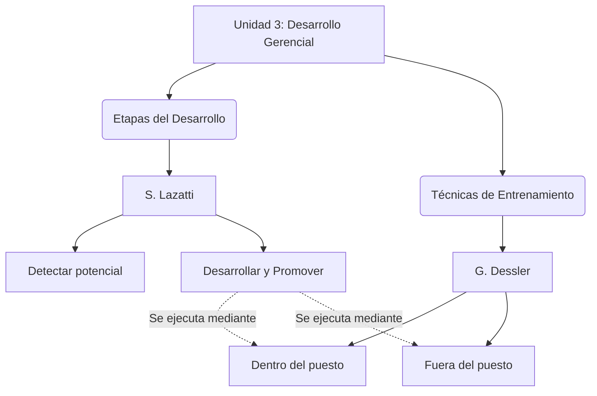
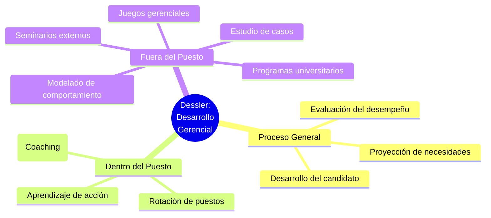
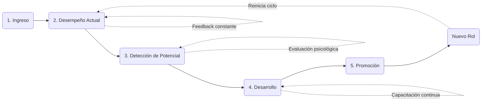

# Infografías - Unidad 3: Desarrollo Gerencial

A continuación se presentan los diagramas visuales para la Unidad 3, en base a los resúmenes de Dessler y Lazatti.

## 1. Infografía Integradora de la Unidad 3

Este diagrama muestra cómo se conectan las etapas del desarrollo (Lazatti) con las técnicas específicas de entrenamiento (Dessler).

---

## 2. Infografía Particular: Gary Dessler (Desarrollo de Gerentes)

Mapa mental sobre los métodos de entrenamiento gerencial según Dessler.

---

## 3. Infografía Particular: Santiago Lazatti (Etapas del Desarrollo)

Diagrama de flujo del ciclo de vida del desarrollo del talento interno.

