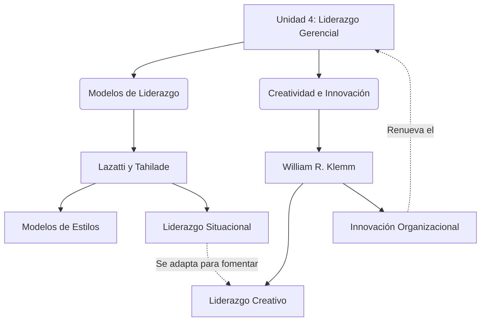
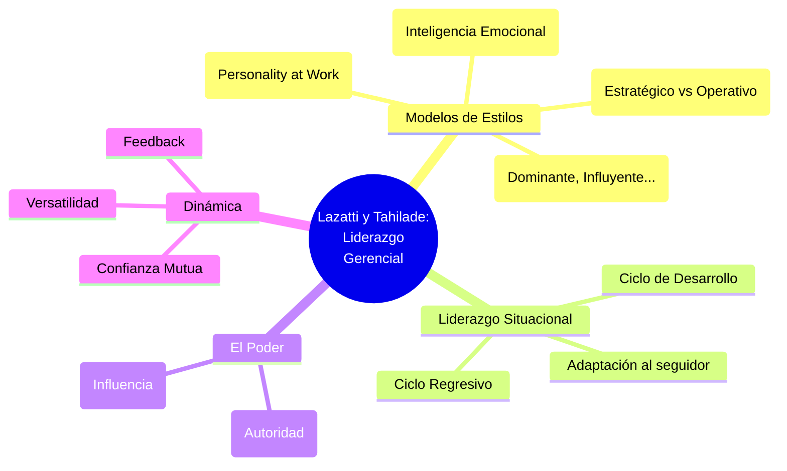
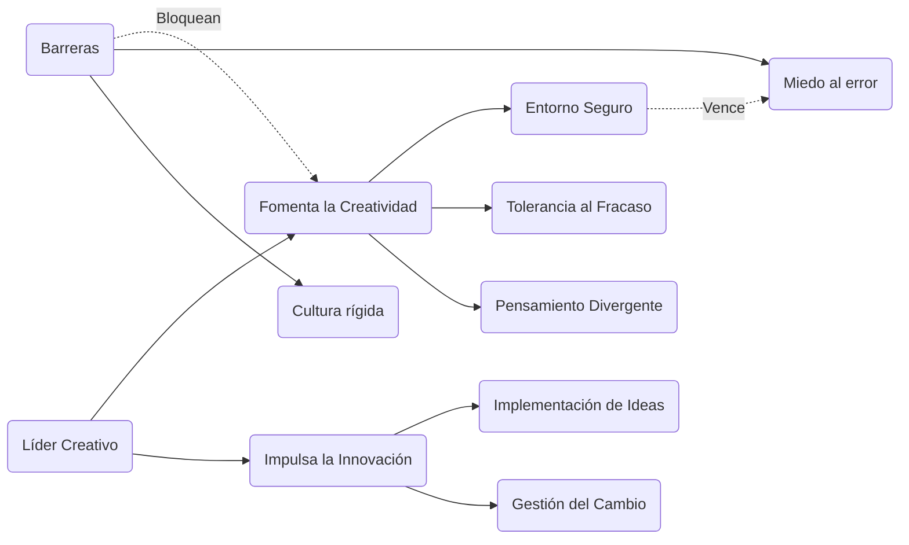

# Infografías - Unidad 4: Liderazgo Gerencial

A continuación se presentan los diagramas visuales para la Unidad 4, en base a los resúmenes de Lazatti & Tahilade y Klemm.

## 1. Infografía Integradora de la Unidad 4

Este diagrama muestra cómo se enlazan el liderazgo gerencial, los diferentes estilos de conducción y la necesidad de creatividad e innovación.

---

## 2. Infografía Particular: Lazatti y Tahilade (Liderazgo Gerencial)

Mapa mental sobre los estilos y enfoques de liderazgo gerencial.

---

## 3. Infografía Particular: William R. Klemm (Liderazgo Creativo e Innovación)

Diagrama sobre el proceso y las barreras para el liderazgo creativo.

