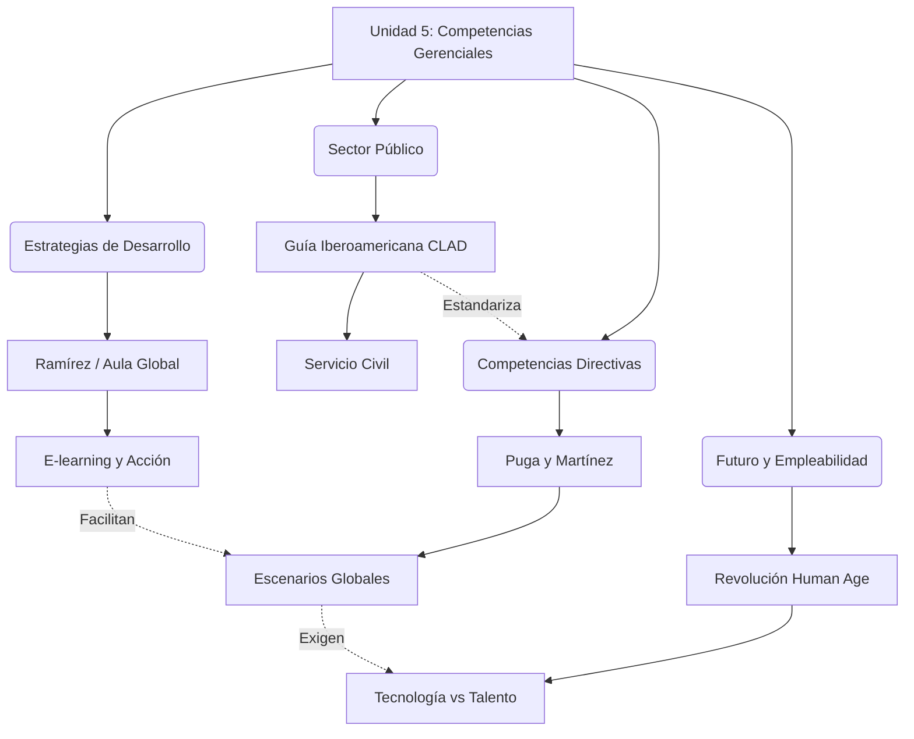
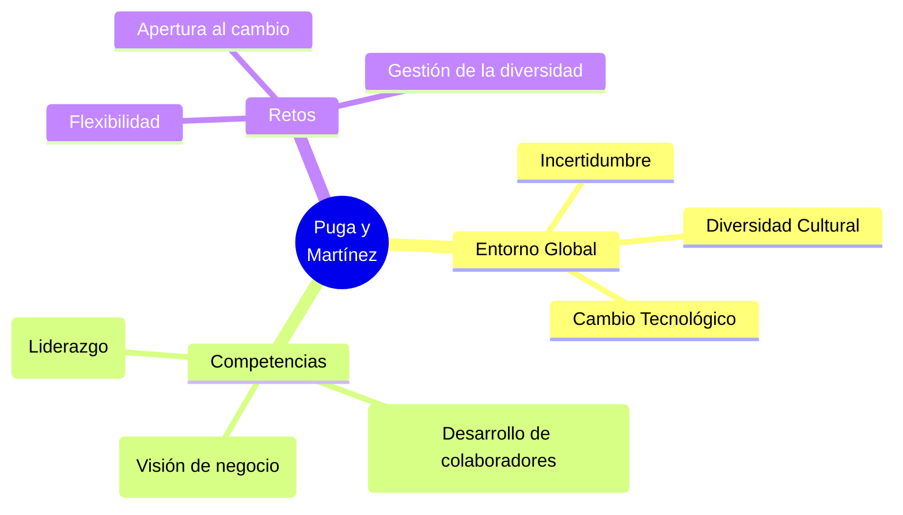
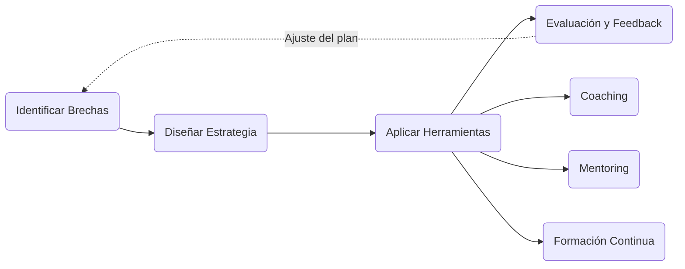
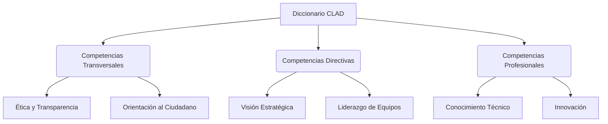
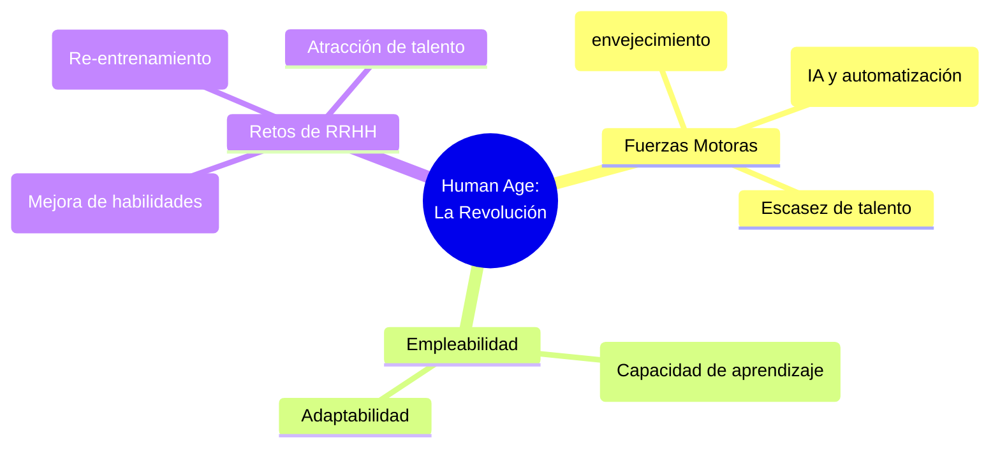
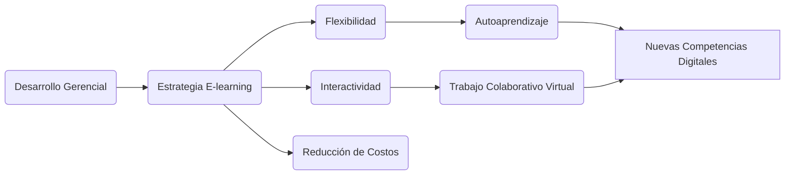

# Infografías - Unidad 5: Competencias Gerenciales

A continuación se presentan los diagramas visuales para la Unidad 5, basados en los cinco textos principales sobre el desarrollo de competencias en el ámbito público y privado.

## 1. Infografía Integradora de la Unidad 5

Este diagrama muestra cómo interactúan las competencias gerenciales, las estrategias para desarrollarlas, la estandarización pública y el futuro del trabajo.

---

## 2. Infografía Particular: Puga y Martínez (Competencias en Escenarios Globales)

Mapa conceptual de las competencias necesarias para la globalización.

---

## 3. Infografía Particular: Luz Ramírez (Estrategias de Desarrollo)

Diagrama sobre el proceso de implementación de competencias.

---

## 4. Infografía Particular: CLAD (Guía Iberoamericana del Sector Público)

Mapa de las competencias exigidas para funcionarios públicos.

---

## 5. Infografía Particular: Serie Human Age (Revolución de las Competencias)

Diagrama sobre la intersección entre tecnología y talento humano.

---

## 6. Infografía Particular: Aula Global (E-learning y Competencias)

Diagrama sobre la educación virtual y el desarrollo de habilidades.

