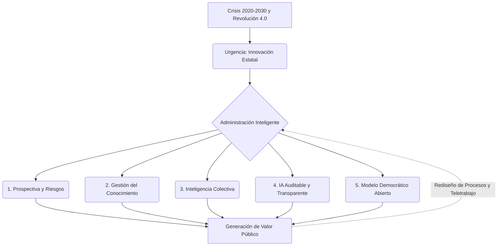

# 🏛️ El Estado del Futuro: Innovación en la Gestión Pública

**Autor / Fuente:** CLAD (Centro Latinoamericano de Administración para el Desarrollo) - Unidad 1
**Tema:** La "Carta Iberoamericana de Innovación en la Gestión Pública" (2020) expone que frente a la década crítica 2020-2030 (marcada por la pandemia, el cambio climático y la Revolución 4.0), el Estado no puede quedarse atrás. Debe abandonar la burocracia rígida y coliderar la transformación tecnológica junto al sector privado, pero inyectando "valores públicos" para preservar el bien común y democratizar los derechos.

---

## 🧭 El Nuevo Paradigma: La Administración Inteligente

La innovación pública no es simplemente "comprar computadoras". Es el proceso de **explorar, asimilar y explotar novedades** para solucionar problemas sociales inéditos. Para ello, el CLAD propone un Estado que combine el **Desarrollo Tecnológico** (Algoritmos) con el **Conocimiento Humano** (Inteligencia Colectiva).

El objetivo supremo de esta inteligencia es generar **Valor Público**: mayor bienestar ciudadano, servicios superiores y erradicación total de la corrupción y la opacidad institucional.

### Los 5 Pilares Estructurales

> [!IMPORTANT]
> **1. Visión Estratégica (Prospectiva)**
> El Estado debe dejar de ser puramente "reactivo" (actuar solo cuando el problema explota). Debe adoptar un pensamiento anticipativo, capaz de mapear riesgos y construir múltiples escenarios futuros.

> [!NOTE]
> **2. Gestión del Conocimiento**
> La tecnología por sí sola es una ilusión si no se cambian las estructuras. La política pública debe basarse en el proceso formal de adquisición, procesamiento y difusión de saberes en toda la organización.

> [!TIP]
> **3. Inteligencia Colectiva**
> Es imperativo desmantelar el encapsulamiento burocrático (donde la información queda aislada en un departamento). La innovación exige colaboración sinérgica entre funcionarios, expertos externos y la propia ciudadanía.

> [!WARNING]
> **4. Inteligencia Artificial y Robótica**
> El uso de IA y Big Data transforma la eficiencia operativa y permite predecir tendencias o fraudes. **Condición Ética Innegociable:** Los algoritmos estatales deben ser totalmente transparentes, auditables por entes independientes y no pueden estar blindados bajo patentes corporativas privativas que impidan el escrutinio social.

> [!NOTE]
> **5. Modelo Relacional Democrático**
> Exige una apertura institucional radical: rendición de cuentas, evaluación externa constante y participación activa de la sociedad en la toma de decisiones.

---

## ⚙️ Dimensiones de la Innovación y el Ecosistema Laboral

La innovación no solo ocurre hacia afuera, también requiere una disrupción en las formas de trabajo interno:

- **Back-Office (Procesos Internos):** Es la dimensión más compleja. Requiere rediseñar organigramas, simplificar normas asfixiantes y asignar "tiempo y espacio" exclusivo para que los empleados públicos puedan pensar creativamente.
- **El Teletrabajo como Catalizador:** No es una simple medida de emergencia. Fomenta el trabajo colaborativo sostenible, haciendo que el trabajo deje de estar "atado a un escritorio físico", transitando hacia un modelo híbrido definitivo.
- **Erradicar la Mentalidad Insular:** El Estado debe crear "redes de innovación abierta" con científicos y académicos que se activen de forma elástica según las urgencias del entorno.

---

## 💼 Ejemplo Real Práctico: Innovación Bidimensional en el Estado

> [!TIP]
> **Caso Práctico: El Sistema de Predicción de Deserción Escolar**
> Un Ministerio de Educación detecta altas tasas de abandono escolar tras una crisis económica.
> 1. En lugar de esperar a que los alumnos dejen la escuela (**abandono reactivo**), el Estado aplica **Visión Prospectiva** e **Inteligencia Artificial**.
> 2. Cruzan datos de inasistencias, ingresos familiares y notas mediante algoritmos de Big Data (totalmente **transparentes y auditables** por ONGs) para predecir qué estudiantes están en mayor riesgo este semestre.
> 3. Al mismo tiempo, rediseñan su **Back-Office**: implementan **Teletrabajo** para los psicopedagogos estatales, permitiéndoles conectarse mediante **Inteligencia Colectiva** con directores de escuelas y trabajadores sociales comunitarios.
> 4. El resultado: Identifican a los alumnos en riesgo y los asisten meses antes de que dejen la escuela. Han generado **Valor Público** incalculable salvaguardando un derecho ciudadano.

---

## 📊 Síntesis del Estado Inteligente

