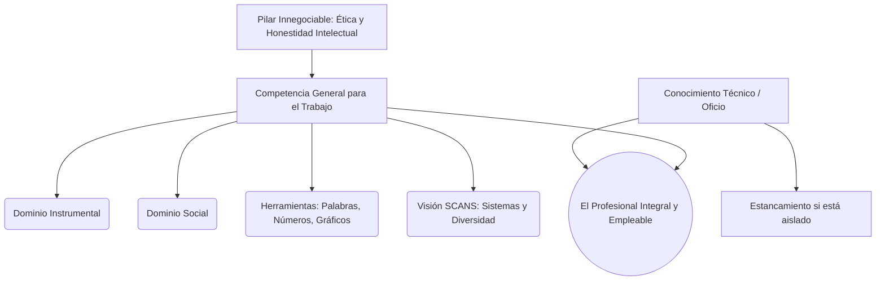

# 🎒 La Educación en la Empresa: Competencias para el Trabajo

**Autor:** Ernesto Gore - Unidad 1
**Tema:** ¿Cuáles deben ser las aptitudes que habiliten a una persona para desempeñarse eficazmente en una organización sin fracasar en el intento? Gore reflexiona sobre el límite del conocimiento técnico puro y la necesidad urgente de desarrollar habilidades instrumentales, sociales y éticas.

---

## 🧠 Competencia Específica vs. Competencia General

Gore establece una distinción vital para entender el estancamiento profesional:
- **Competencia Específica:** Es la educación técnica mínima requerida para ejercer un oficio puntual. Si solo se tiene esto, el progreso del individuo se frena, y su calificación salarial y valor caen con el paso de los años.
- **Competencia General para el Trabajo:** Es la destreza para "organizarse e insertarse" en una estructura. Implica proyectarse a cinco años, armar un currículum real, tejer redes de contactos y saber venderse.

---

## 🛠️ Las 5 Versiones de las Competencias

A través de su experiencia y recolección de estudios, Gore estructura cinco visiones sobre lo que el mercado laboral realmente demanda:

### 1. El Modelo de los Dos Dominios (Versión 2)
> [!NOTE]
> **Dominio Instrumental (Gestión y Control)**
> - **Uso del Tiempo:** No solo usar una agenda, sino estimar plazos largos para proyectos y calcular cronogramas mentales constantemente.
> - **Resolución de Problemas:** Definir obstáculos, sopesar alternativas y modelizar escenarios futuros en papel antes de actuar.
> - **Acrecentar Conocimiento:** Aprender bajo presión y operar bajo estrictas normas de seguridad.

> [!IMPORTANT]
> **Dominio Social (Gestión Humana)**
> - **Comunicación y Liderazgo:** Habilidad para enseñar a otros, dar instrucciones útiles y claras, y tener el coraje de defender las necesidades del propio equipo frente a otros sectores sin dinamitar las relaciones.

### 2. El Diagnóstico Actitudinal (Taller U. San Andrés, Versión 3)
> [!WARNING]
> **Las Fallas de la Juventud y el Pilar Ético**
> El taller de expertos determinó que los fracasos no ocurren por falta de instrucción académica técnica, sino por **actitud**. Los jóvenes buscan éxito rápido sin estar dispuestos a cumplir horarios o asumir tareas que consideran "indignas" inicialmente.
> Gore eleva **la Ética** a competencia estratégica: la honestidad intelectual y laboral es innegociable. La falta de ética no siempre castiga al individuo de inmediato, pero genera un "daño colectivo" que destruye a la organización a largo plazo. La ética exige alinear lo que se dice con lo que se hace y prever las consecuencias de los actos propios.

### 3. Las Herramientas de Juan Rada (Versión 4)
> [!NOTE]
> **Las 4 Herramientas Cognitivas Básicas**
> 1. **Palabras:** Expresarse de forma oral y escrita buscando la *brevedad y la concisión*.
> 2. **Números:** Dominio absoluto de presupuestos y su vínculo directo con las estrategias empresariales.
> 3. **Gráficos:** Usar mapas lógicos y esquemas; vía privilegiada para hacer comprensible la información compleja.
> 4. **Información:** Capacidad de recuperar y clasificar bases de datos de forma estratégica.

### 4. El Modelo SCANS (Versión 5)
> [!TIP]
> **El Informe Norteamericano de Éxito Laboral**
> Un trabajador integral domina: Destrezas Interpersonales (enseñar, negociar, abrazar la diversidad cultural); Sistemas (comprender cómo interactúan las redes sociales y tecnológicas para corregir fallas estructurales) y Tecnología (criterio para seleccionar y mantener equipos).

---

## 💼 Ejemplo Real Práctico: El Analista Brillante pero Estancado

> [!TIP]
> **Caso Práctico: El Límite de la Competencia Específica**
> Martín es un analista financiero sobresaliente. Su **Competencia Específica** para armar modelos matemáticos es inigualable en la empresa. Sin embargo, lleva 6 años en el mismo puesto sin ser ascendido a Gerente.
> - **Problema de Dominio Instrumental:** Martín no sabe estimar el tiempo de sus proyectos a largo plazo y siempre entrega los reportes tarde.
> - **Problema de Herramientas (Juan Rada):** Sus informes escritos tienen 50 páginas. Carece por completo de la herramienta de "Palabras" orientada a la **brevedad**.
> - **Problema de Dominio Social:** Cuando presenta sus resultados, no tolera preguntas de otros departamentos, reaccionando a la defensiva en lugar de liderar constructivamente.
> **El veredicto de Gore:** A Martín no le faltan cursos de finanzas; le falta educación organizacional en competencias generales para el trabajo.

---

## 📊 Síntesis Visual de la Empleabilidad

