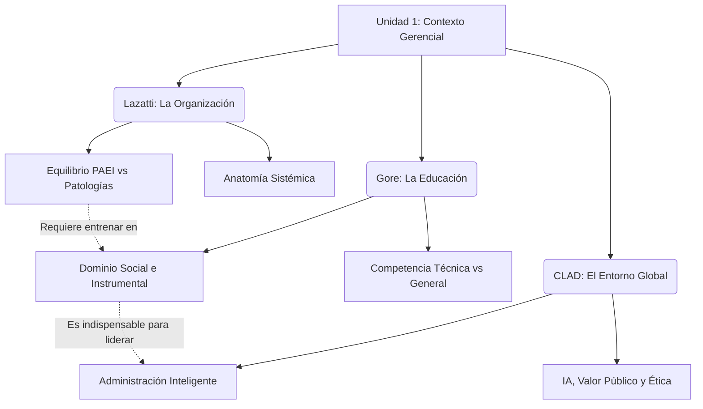

# 🌐 Infografía Integradora: Unidad 1

**Tema:** El Mapa Contextual del Desarrollo Gerencial
**Autores:** Santiago Lazatti, Ernesto Gore, CLAD

La Unidad 1 nos sumerge de lleno en la fundamentación del "Desarrollo Gerencial", construyendo un mapa mental que va desde las entrañas de una empresa (la anatomía organizacional) hasta el rol fundamental del Estado frente al futuro tecnológico mundial.

---

## 🔗 La Matriz Analítica: Cómo se Entrelazan los Autores

> [!NOTE]
> **1. El Campo de Juego y sus Fallas (Lazatti)**
> El viaje comienza con **Lazatti**, quien nos proporciona el tablero: la empresa no es solo un conjunto de tareas, sino una *Anatomía* compleja dividida en Entorno, Management, Operación y Resultados. Para no llevar a la organización al colapso mediante "patologías" (como el *Burócrata* o el *Incendiario*), se requiere un equipo que equilibre cuatro funciones críticas (PAEI). El gerente no puede depender solo de su capacidad de Producción (operativa); debe saber Administrar, Estrategizar e Integrar humanos.

> [!IMPORTANT]
> **2. La Construcción del Jugador Integral (Gore)**
> Aquí interviene **Gore** para responder a la falencia de Lazatti: Si el directivo no puede ser un simple "Solitario (P---)", ¿cómo lo formamos? Gore aclara que la escuela tradicional nos da la *Competencia Específica* (el saber técnico para ser Productor), pero la verdadera educación en la empresa consiste en forjar la **Competencia General**. Esto implica inyectarle a ese gerente habilidades instrumentales (uso de tiempo, recursos) y sociales (comunicación, ética) para que pueda convertirse en un Integrador y un Estratega efectivo que entienda el comportamiento organizacional.

> [!TIP]
> **3. El Desafío Final: El Entorno Macro y el Bien Común (CLAD)**
> Con líderes integralmente formados (Gore) liderando estructuras funcionalmente sanas (Lazatti), el **CLAD** eleva la discusión al nivel institucional público. Señala que este nivel de excelencia gerencial no debe restringirse al mercado corporativo. El Estado está obligado a modernizar su propia anatomía ("back-office") y desarrollar gerentes públicos inteligentes que apliquen la *Visión Prospectiva*, el *Teletrabajo* y la *Inteligencia Colectiva*. Solo así el gobierno podrá regular algoritmos, enfrentar pandemias o crisis climáticas, y garantizar que la tecnología sirva para generar **Valor Público** y fortalecer la democracia.

---

## 💼 Ejemplo Real Práctico: Transformación de Escala Completa

> [!TIP]
> **Caso Práctico: La Modernización de un Ministerio Público**
> Imaginemos un Ministerio de Transporte ineficiente que decide transformarse:
> 
> 1. **El Diagnóstico (Lazatti):** El nuevo Ministro analiza su estructura y nota que su equipo directivo sufre de la patología del *Burócrata (-A--)*; son excelentes llenando planillas y cumpliendo normas (Sistema Administrativo), pero jamás proponen ideas nuevas para modernizar la movilidad urbana.
> 2. **La Capacitación (Gore):** Se implementa un plan intensivo para que estos directivos adquieran **Competencias Generales**. A través del *Dominio Social*, se les entrena en liderazgo y resolución de problemas para que dejen de esconderse detrás de los manuales de procedimiento. Y se refuerza innegociablemente la **Ética** como requisito laboral ante la adjudicación de licitaciones.
> 3. **La Implementación Tecnológica (CLAD):** Con una mentalidad ahora orientada a resultados y empatía social, el Ministerio aplica **Inteligencia Artificial** de forma transparente y auditable para analizar patrones de tráfico. Rediseñan sus procesos internos mediante la **Inteligencia Colectiva**, logrando un servicio de transporte predictivo y eficiente que devuelve la confianza ciudadana al Estado.

---

## 📊 Síntesis Visual Integradora

