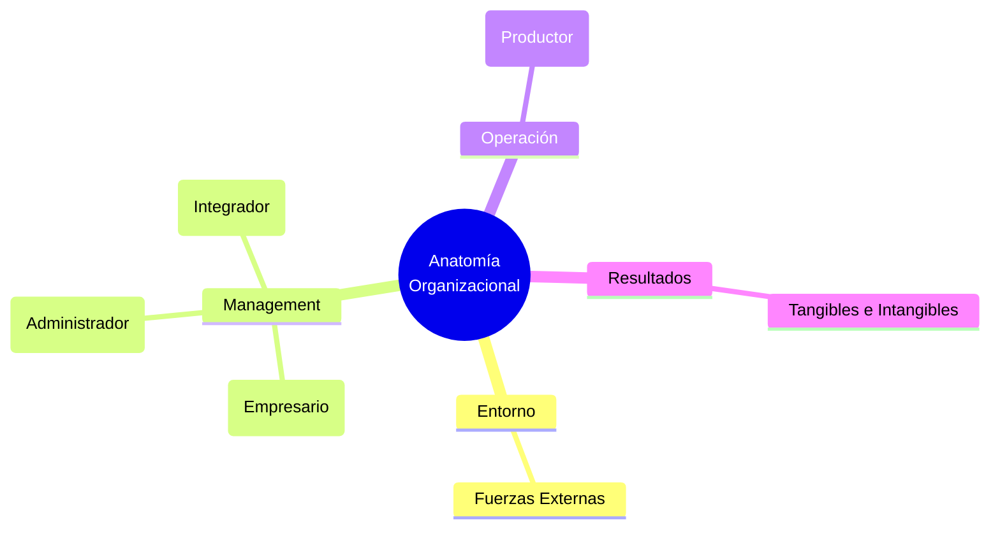

# 🏢 Funciones Gerenciales: Anatomía y Management

**Autor:** Santiago Lazatti - Unidad 1
**Tema:** El trabajo gerencial no ocurre en el vacío. Para entender el rol del directivo, primero hay que diseccionar la anatomía de la organización como un sistema vivo (Entorno, Management, Operación y Resultados) y, sobre esa base, equilibrar las funciones críticas para evitar el colapso patológico.

---

## 🧭 La Anatomía de la Organización

Toda empresa es una estructura sistémica conformada por cuatro grandes campos entrelazados:

> [!NOTE]
> **1. El Entorno**
> Presiona a la empresa desde tres niveles: el **Macro** (tecnología, economía global), el **Ramo de Actividad** (regulaciones específicas del sector) y el **Próximo** (accionistas, clientes, competencia, sindicatos).

> [!IMPORTANT]
> **2. El Management (El Núcleo Directivo)**
> Se divide obligatoriamente en tres áreas:
> - **Planificación Estratégica:** Fija el rumbo, la misión, visión, estrategias de mercado y objetivos medibles.
> - **Sistema Administrativo:** El "cómo" bajar la estrategia a la realidad (Organigrama, normas, control presupuestario, auditorías, administración de personal).
> - **Factor Humano:** La dimensión informal. El estilo de liderazgo, el clima laboral, las relaciones interpersonales, el manejo del conflicto, el sistema real de premios y la Cultura Organizacional subyacente.

> [!TIP]
> **3. La Operación y 4. Los Resultados**
> La **Operación** es la interacción pura donde los insumos (financieros, físicos) sufren transformaciones técnicas para convertirse en productos finales. Los **Resultados** retroalimentan todo el sistema, pudiendo ser tangibles (rentabilidad) o intangibles (posicionamiento y clima laboral).

---

## 🧩 El Modelo PAEI: Las 4 Caras del Gerente

Sobre esta base anatómica, Lazatti se apoya en el modelo de Ichak Adizes. Como el gerente perfecto no existe, se requiere conformar un "equipo directivo complementario" que logre abarcar cuatro funciones:

- **[P] Productor:** Su objetivo es "hacer que las cosas pasen" en el área funcional. Exige empuje y gran "know-how" técnico. (Vinculado a la **Operación**).
- **[A] Administrador:** Sistematiza, coordina, diseña normas y ejerce un control riguroso para mantener el orden. (Vinculado al **Sistema Administrativo**).
- **[E] Empresario:** Identifica oportunidades a largo plazo, innova y asume riesgos calculados frente a entornos turbulentos. (Vinculado a la **Planificación Estratégica**).
- **[I] Integrador:** El creador de espíritu de equipo (*team building*). Amalgama los riesgos individuales en metas grupales, motiva y resuelve fricciones. (Vinculado al **Factor Humano**).

---

## ⚠️ Patologías Gerenciales (El Lado Oscuro)

Si un directivo desarrolla desproporcionadamente una función y es incompetente en las demás, surgen patologías tóxicas para la anatomía organizacional:

- 🐺 **El Solitario (P---):** Muy trabajador, conoce su oficio al revés y al derecho, pero hace todo solo. Desperdicia todo el talento de su equipo porque es incapaz de delegar o integrar.
- 🗄️ **El Burócrata (-A--):** Se obsesiona con las normas y el "cómo", olvidando el "para qué". Aborrece profundamente la ambigüedad y el cambio, volviendo a la empresa lenta y estéril.
- 🔥 **El Incendiario (--E-):** Dispara iniciativas creativas constantes pero las abandona a la mitad. Carece de orden administrativo (A) y de interés real por las personas (I). Su equipo vive estresado intentando "apagar sus incendios".
- 🤗 **El Superseguidor (---I):** Se obsesiona tanto por agradar a todos que evita los conflictos a toda costa. El "gerente de club campestre" que se vuelve tan complaciente que jamás toma decisiones necesarias o difíciles.
- 🪵 **El Palo Muerto (----):** Nulo desempeño en todas las letras. Un ente institucional.

---

## 💼 Ejemplo Real Práctico: El Equipo Fundador Desequilibrado

> [!TIP]
> **Caso Práctico: El CEO Incendiario**
> Carlos funda una empresa de software. Tiene una personalidad **Incendiaria (--E-)**: todos los lunes propone crear una nueva App revolucionaria. Su equipo de programadores comienza a renunciar masivamente por agotamiento extremo (nunca terminan un proyecto).
> **Solución basada en PAEI:** Carlos entiende que no puede cambiar su naturaleza creativa, pero sí la anatomía de su organización. Contrata a Ana como COO (Directora de Operaciones), quien tiene un perfil **Burócrata/Administrador (-A--)** para poner orden y frenar sus impulsos, y a Luis, un perfil **Integrador (---I)** para recomponer el clima laboral con los programadores. Ahora, el *equipo* directivo en su conjunto forma un **PAEI** completo y saludable.

---

## 📊 Síntesis Visual

