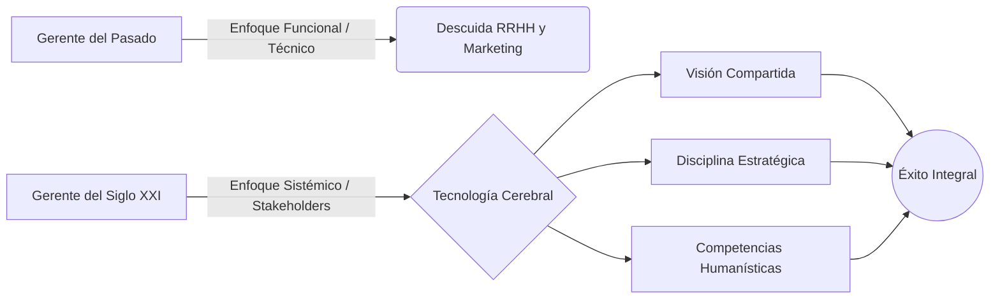

# 🚀 La Gerencia del Siglo XXI

**Autor:** John Orlando Crissien Castillo - Unidad 2
**Tema:** El mundo actual de los negocios sufre un cambio vertiginoso impulsado por la globalización y la tecnología. Los viejos modelos gerenciales, puramente funcionales, han fracasado. El gerente moderno no solo administra cosas; lidera seres humanos.

---

## 🧭 La Evolución del Liderazgo

Crissien Castillo describe cómo han cambiado los paradigmas de éxito:
- **Enfoque del Pasado (Funcional):** El éxito dependía de la habilidad técnica pura del gerente. Si el gerente era buen panadero, toda la empresa se volcaba a la producción, descuidando el marketing y los recursos humanos. Era un sistema desequilibrado.
- **Evolución por Décadas:** En los '80 la clave fue la *calidad y productividad*; en los '90 fue el *empoderamiento* (dar autonomía a los empleados).
- **Enfoque del Siglo XXI (Sistémico):** Irrumpe Internet y un fuerte retorno a la "espiritualidad" corporativa y al individuo. La empresa es un sistema vivo donde todos los actores o "Stakeholders" (proveedores, empleados, sociedad) generan valor en conjunto.

---

## 🛠️ El Gerente Líder: Las 5 Competencias de la "Tecnología Cerebral"

El autor decreta (basado en Deming) que el líder es responsable del 100% de lo que pasa en su organización. Para asegurar Supervivencia, Rentabilidad y Crecimiento, el gerente debe dominar cinco bloques:

> [!IMPORTANT]
> **1. Visión Compartida**
> No basta con tener metas numéricas. El gerente debe conocer el "ser" de los empleados y por qué hacen lo que hacen, inspirando un profundo sentido de pertenencia.

> [!NOTE]
> **2. Agudeza Factorial y Pensamiento Mercadológico**
> El cliente moderno, empoderado por Internet, exige productos individualizados. El gerente debe investigar a la especie humana (ej. diseñar autos para el nicho "JASP: Jóvenes Aunque Sobradamente Preparados").

> [!TIP]
> **3. Disciplina del Proceso Administrativo**
> Operar con rigor inquebrantable: fijar tiempos, asumir resultados, evaluar fracasos y reiniciar el ciclo bajo normas éticas y valores.

> [!WARNING]
> **4. Competencias Humanísticas**
> El líder frío se transforma en alguien genuinamente querido si escucha y ve en su equipo reales oportunidades de crecimiento personal. La regla de oro: pensar en la gente como el activo principal.

> [!NOTE]
> **5. Armonía Integral y Comunicación (Sintonía Múltiple)**
> El líder es un catalizador que absorbe y resuelve problemas. Para comunicar eficazmente, debe identificar cómo procesa la información su equipo: algunos son *Visuales*, otros *Kinestésicos* (sienten) y otros *Auditivos*.

---

## 💼 Ejemplo Real Práctico: El Sentido de Pertenencia

> [!TIP]
> **Caso Práctico: Creando Identidad**
> Para materializar la "Visión Compartida", no sirven los memorándums aburridos. Crissien Castillo ilustra esto con una técnica real: un gerente que regala a su equipo directivo objetos de la más alta gama mundial (como relojes suizos o palos de golf de élite) que llevan impreso el **logotipo de su propia empresa**.
> *¿El objetivo?* Enviar un mensaje psicológico profundo: "Nosotros somos de calidad mundial". Esto empodera emocionalmente al colaborador, conectando el lujo de la herramienta con el prestigio que sienten por trabajar en esa organización. El autor, sacándolo del plano religioso, pone como metáfora suprema de este "liderazgo carismático e inspirador" a la figura histórica de Jesús de Nazaret, quien lograba transformar seres humanos ordinarios en apóstoles extraordinarios mediante la motivación y el respeto al "ser".

---

## 📊 Síntesis Visual de la Evolución Gerencial

