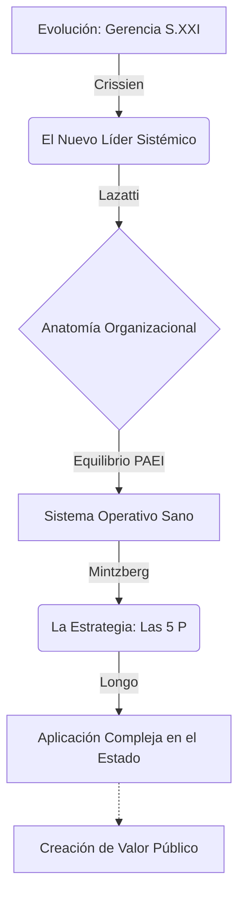

# 🌐 Infografía Integradora: Unidad 2

**Tema:** La Anatomía de la Gerencia Pública y Privada
**Autores:** Crissien Castillo, Lazatti, Mintzberg, Longo

La Unidad 2 despliega el campo de batalla de la gerencia moderna: desde la anatomía interna de las corporaciones y sus tácticas, hasta el monumental desafío de trasladar esa misma mentalidad orientada a resultados hacia el Estado moderno.

---

## 🔗 Cómo se enlazan los Autores

> [!NOTE]
> **1. El Líder Sistémico y su Estructura (Crissien y Lazatti)**
> Empezamos con **Crissien Castillo**, quien nos dice que el gerente funcional del pasado murió. El líder del Siglo XXI aplica un "enfoque sistémico" y domina competencias humanísticas para alinear a todos sus *stakeholders*. **Lazatti** estructura exactamente esa afirmación dándole cuerpo: todo ese sistema debe administrarse entendiendo la *Anatomía de la Organización* (Entorno, Management, Operaciones y Resultados). Lazatti advierte que si el líder falla en balancear estas partes (modelo PAEI), se transforma en una patología organizacional tóxica (como el Solitario o el Incendiario).

> [!IMPORTANT]
> **2. La Táctica de Supervivencia (Mintzberg)**
> Con un líder competente operando una anatomía equilibrada, la empresa debe salir a competir. Aquí entra **Mintzberg** con las **5 P de la Estrategia**. La organización debe utilizar la historia de sus *Patrones* pasados y diseñar un *Plan* a futuro para obtener una *Posición* ventajosa, todo ello sostenido por una *Perspectiva* corporativa sólida y la capacidad astuta de realizar *Pautas* o maniobras para desestabilizar a los rivales.

> [!TIP]
> **3. La Evolución Inevitable del Estado (Longo)**
> Conociendo cómo opera la gerencia privada al más alto nivel, **Francisco Longo** toma esta teoría y la traslada al sector público. Explica que el "Estado Prestador" moderno ya no puede limitarse a que sus burócratas cumplan leyes pasivamente; la ciudadanía exige eficacia y estrategia. Surge así la necesidad vital de "Institucionalizar la Gerencia Pública". El directivo estatal debe aplicar el modelo corporativo (Lazatti y Mintzberg) asumiendo el rol de *Gestor Estratégico y Operativo* para "crear valor público", pero superando barreras inmensas como la politización y el amiguismo (clientelismo).

---

## 💼 Ejemplo Real Práctico: La Modernización de un Municipio

> [!TIP]
> **Caso Práctico: El Director de Obras Públicas**
> El nuevo Director de Obras asume su rol en un municipio estancado.
> 1. Entiende la Anatomía Municipal (**Lazatti**): Sabe que su departamento está sufriendo la patología del *Burócrata (-A--)*, donde los inspectores de obra solo llenan planillas y nunca construyen nada.
> 2. Como Líder del Siglo XXI (**Crissien**), aplica competencias humanísticas para escuchar a los inspectores frustrados y les brinda "Empoderamiento", dándoles responsabilidades reales que mejoren su compromiso.
> 3. Para modernizar la infraestructura vial del municipio, diseña una estrategia combinando una **Pauta** (maniobra) en redes sociales y un **Plan** corporativo de licitaciones a largo plazo (**Mintzberg**).
> 4. Sin embargo, el Concejo Deliberante se opone a su estrategia porque temen perder popularidad en las próximas elecciones (El peligro de la *Politización* - **Longo**). El director ejerce su *Gestión Política* (Political Management) para convencer a la oposición, defender su autonomía como Gerente Público, y lograr que la reforma sobreviva a las trabas políticas de corto plazo.

---

## 📊 Síntesis Visual Integradora

