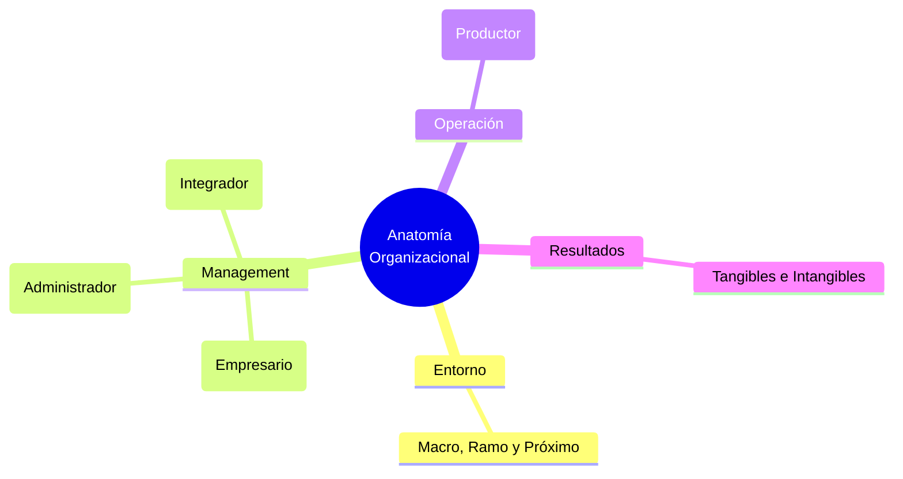

# 🏢 Funciones Gerenciales: Anatomía y Management

**Autor:** Santiago Lazatti - Unidad 2
**Tema:** El trabajo gerencial no ocurre en el vacío. Para entender el rol del directivo, primero hay que diseccionar la anatomía de la organización como un sistema vivo (Entorno, Management, Operación y Resultados) y, sobre esa base, equilibrar las funciones críticas para evitar el colapso patológico.

---

## 🧭 La Anatomía de la Organización

Toda empresa es una estructura sistémica conformada por cuatro grandes campos entrelazados:

> [!NOTE]
> **1. El Entorno**
> Presiona a la empresa desde tres niveles: el **Macro** (tecnología, economía global, pandemias), el **Ramo de Actividad** (regulaciones específicas del sector petrolero, bancario, etc.) y el **Próximo** (accionistas, clientes, competencia directa, sindicatos).

> [!IMPORTANT]
> **2. El Management (El Núcleo Directivo)**
> Se divide obligatoriamente en tres áreas:
> - **Planificación Estratégica:** Fija el rumbo, la misión, visión, estrategias de mercado y objetivos medibles (rentabilidad y crecimiento).
> - **Sistema Administrativo:** El "cómo" bajar la estrategia a la realidad (Organigrama, normas, control presupuestario, auditorías, administración formal de personal).
> - **Factor Humano:** La dimensión informal. El estilo de liderazgo, el clima laboral (confianza, cordialidad), el manejo del conflicto, el sistema real de premios y la Cultura Organizacional subyacente (ritos y mitos de la empresa).

> [!TIP]
> **3. La Operación y 4. Los Resultados**
> La **Operación** es la interacción pura donde los insumos (financieros, físicos, humanos) sufren transformaciones técnicas para convertirse en outputs (productos finales). Los **Resultados** retroalimentan todo el sistema, pudiendo ser tangibles (rentabilidad y patrimonio) o intangibles (posicionamiento en la comunidad y clima laboral).

---

## 🧩 El Modelo PAEI: Las 4 Caras del Gerente

Sobre esta base anatómica, Lazatti se apoya en el modelo de Ichak Adizes. Como el gerente perfecto no existe, se requiere conformar un "equipo directivo complementario" que logre abarcar cuatro funciones:

- **[P] Productor:** Su objetivo es "hacer que las cosas pasen" en el área funcional. Exige empuje y gran "know-how" técnico. (Vinculado estrechamente al campo de la **Operación**).
- **[A] Administrador:** Sistematiza, coordina, diseña procedimientos y ejerce un control riguroso para mantener el orden de la empresa. (Vinculado directamente al **Sistema Administrativo**).
- **[E] Empresario:** Identifica oportunidades a largo plazo, innova y asume riesgos calculados frente a entornos turbulentos. (Vinculado a la **Planificación Estratégica**).
- **[I] Integrador:** El creador de espíritu de equipo (*team building*). Amalgama los riesgos individuales en metas grupales, motiva y resuelve fricciones interpersonales. (Vinculado de lleno al **Factor Humano**).

---

## ⚠️ Patologías Gerenciales (El Lado Oscuro)

Si un directivo desarrolla desproporcionadamente una función y es incompetente en las demás, surgen patologías tóxicas para la anatomía organizacional:

- 🐺 **El Solitario (P---):** Muy trabajador, conoce su oficio al revés y al derecho, pero hace todo solo. Desperdicia todo el talento de su equipo porque es incapaz de lograr objetivos a través de los demás.
- 🗄️ **El Burócrata (-A--):** Se obsesiona con las normas y el "cómo", olvidando por completo el "para qué" existen. Aborrece profundamente la ambigüedad y el cambio, volviendo a la empresa lenta y estéril. Solo se premia por cumplir reglas, aunque la empresa quiebre.
- 🔥 **El Incendiario (--E-):** Dispara iniciativas creativas y audaces pero las abandona a la mitad. Carece de orden administrativo (A) y de interés real por las personas (I). Nunca evalúa consecuencias, dejando que su equipo viva agotado "apagando sus incendios".
- 🤗 **El Superseguidor (---I):** Se obsesiona tanto por agradar a todos que evita los conflictos a toda costa. Es el "gerente de club campestre" que se vuelve tan complaciente que jamás toma decisiones duras o necesarias para el negocio por miedo a dejar de ser querido.
- 🪵 **El Palo Muerto (----):** Nulo desempeño en todas las letras. Un peso muerto para la estructura que no produce, no organiza, no crea y no une a nadie.

---

## 💼 Ejemplo Real Práctico: El Equipo Fundador Desequilibrado

> [!TIP]
> **Caso Práctico: El CEO Incendiario**
> Carlos funda una empresa de software. Tiene una personalidad **Incendiaria (--E-)**: todos los lunes propone crear una nueva App revolucionaria. Su equipo de programadores comienza a renunciar masivamente por agotamiento extremo (nunca terminan un proyecto y viven en el caos).
> **Solución basada en PAEI:** Carlos entiende que no puede cambiar su naturaleza creativa, pero sí la anatomía de su organización. Contrata a Ana como COO (Directora de Operaciones), quien tiene un perfil **Burócrata/Administrador (-A--)** para poner orden férreo y frenar sus impulsos erráticos, y a Luis, un perfil **Integrador (---I)** para recomponer urgentemente el clima laboral con los programadores. Ahora, el *equipo* directivo en su conjunto forma un **PAEI** completo y saludable, protegiendo la supervivencia de la empresa.

---

## 📊 Síntesis Visual

