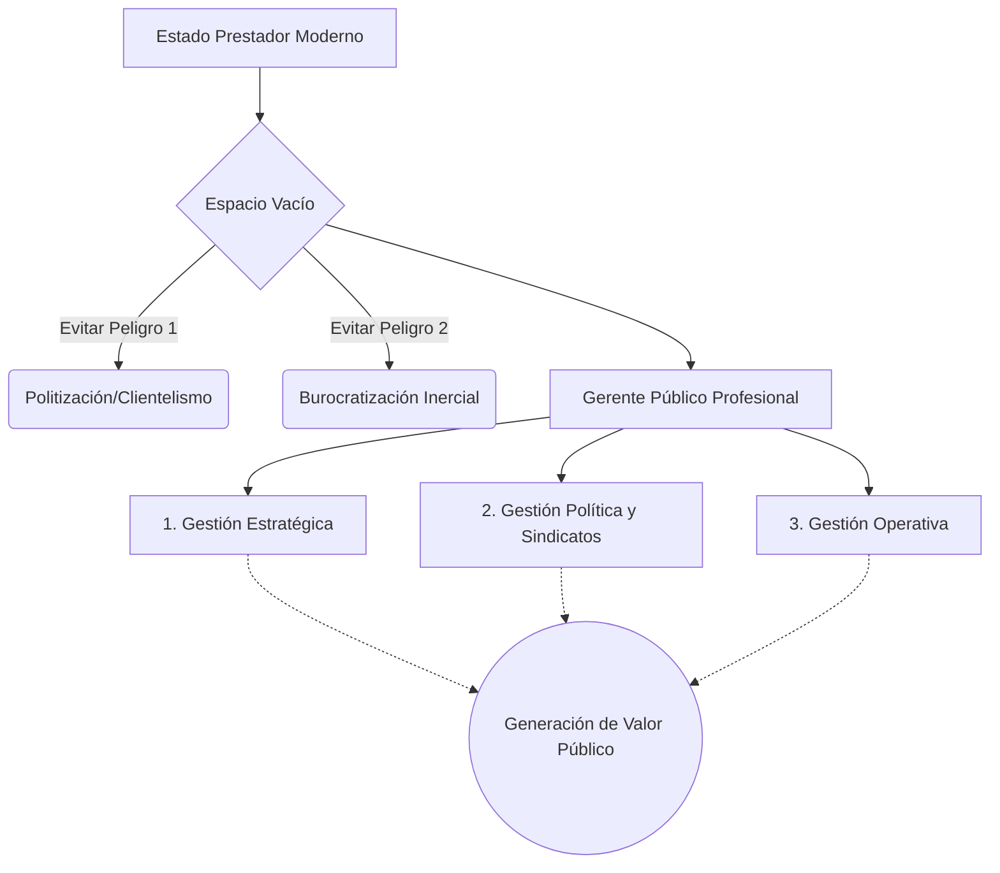

# 🏛️ Institucionalizar la Gerencia Pública

**Autor:** Francisco Longo - Unidad 2
**Tema:** La administración pública tradicional colapsó frente a las nuevas demandas ciudadanas. El Estado ya no puede limitarse a "cumplir la ley"; debe ser eficiente como una empresa privada. Sin embargo, introducir verdaderos "Gerentes Públicos" choca contra graves obstáculos políticos y burocráticos.

---

## 🧭 La Crisis del Modelo Weberiano y el "Estado Prestador"

El modelo tradicional (Weberiano) dividía todo en dos polos:
1. **La Clase Política:** Los elegidos democráticamente que tienen la autoridad.
2. **Los Funcionarios (Burócratas):** Los que ejecutan la ley de forma imparcial.

Este dualismo se rompe cuando nace el **"Estado Prestador"** (o de bienestar). Al proveer salud, educación y servicios complejos, los ciudadanos exigen *eficacia*, no solo que el trámite sea legal. Surge un "espacio vacío" que ni el político (inestable) ni el burócrata rutinario (inflexible) pueden llenar. 
Las crisis de presupuesto obligaron a inyectar disciplina, apareciendo el **Gerente Público** como portador de la racionalidad económica.

---

## ⚠️ Los Dos Peligros (Derivas) de la Gerencia Pública

Si no se institucionaliza correctamente este nuevo rol, el gerente es fagocitado por los viejos actores:
- **1. La Politización (Colonización):** El cargo gerencial asume un sesgo clientelar. Los políticos llenan estos puestos directivos con "amigos" o afiliados partidarios, destruyendo la calidad profesional.
- **2. La Burocratización:** La función pública tradicional absorbe al gerente, transformándolo en un autómata que solo ejecuta normas y procedimientos inerciales, perdiendo la capacidad de responsabilizarse por los verdaderos resultados.

---

## 🛠️ El Modelo de Mark Moore: Creador de Valor Público

Un gerente público actúa en tres esferas simultáneas para generar valor:

> [!IMPORTANT]
> **1. Gestión Estratégica**
> Reformular constantemente la misión para descubrir cómo crear el máximo valor público posible.

> [!NOTE]
> **2. Gestión del Entorno Político (*Political Management*)**
> La más compleja del Estado. El gerente debe buscar legitimidad, fondos y apoyo de su "entorno autorizante", negociando con grupos sobre los que no tiene autoridad (sindicatos, ciudadanos, prensa).

> [!TIP]
> **3. Gestión Operativa**
> Lograr que los recursos humanos y técnicos actúen de manera eficiente para cumplir las metas operativas diarias.

---

## 🏛️ Los 4 Pilares del Ecosistema Institucional

Para que el directivo sobreviva a la presión política y burocrática, requiere:
1. **Discrecionalidad Directiva (Right to Manage):** Los políticos deben delegar el poder formal y no interferir en la micro-gestión cotidiana.
2. **Accountability (Rendición de Cuentas):** Control exhaustivo basado en resultados, evitando que la autonomía degenere en "feudos tecnocráticos".
3. **Sistema de Incentivos:** Para retener el talento gerencial sin caer en arbitrariedades o clientelismos.
4. **Ethos Específico:** Su valor ético central es el *Value for Money* británico: maximizar el impacto público con cada peso invertido, evaluando siempre los costos de oportunidad.

---

## 💼 Ejemplo Real Práctico: El Tótem de la Formación

> [!TIP]
> **Caso Práctico: Capacitar sin dar Poder**
> Longo advierte sobre un error letal de los gobiernos: confundir el entrenamiento con la reforma estructural.
> Un Ministro de Salud contrata los mejores posgrados en Harvard para los directores de sus hospitales públicos (creyendo que así instaurará la "gerencia pública"). Pero la ley vigente sigue exigiendo que cada compra de insumos, sin importar lo pequeña que sea, deba ser aprobada y firmada por el Ministro. 
> *Resultado:* Los directores regresan súper capacitados (**Soft skills**), pero sin ninguna **Discrecionalidad Directiva (Right to manage)** para tomar decisiones en sus hospitales. Esto genera frustración masiva, "quemando" a los profesionales, porque se apostó a la capacitación sin desmantelar la estructura centralista.

---

## 📊 Síntesis Visual del Gerente Público

