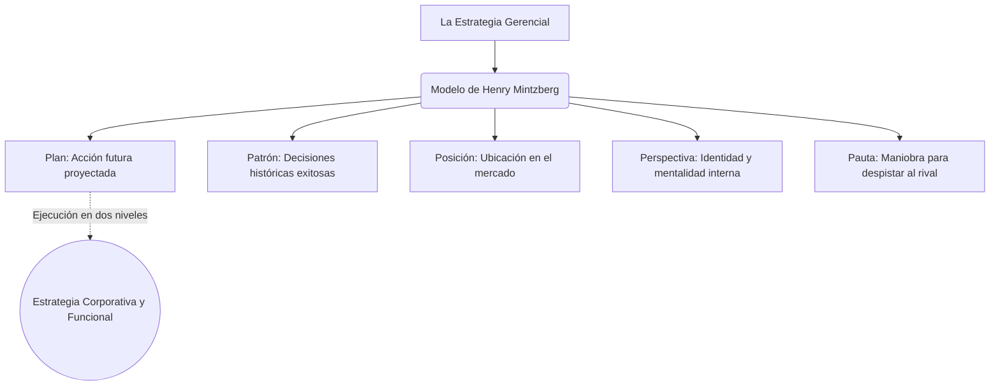

# ♟️ Estrategias Gerenciales: Las 5 P

**Autores:** Henry Mintzberg (y otros) - Unidad 2
**Tema:** La estrategia no es solo un plan estático de negocios; es la táctica deliberada que ejecuta una institución para lograr diferenciarse y sobrevivir. Tomando conceptos desde Michael Porter hasta Sun Tzu, el directivo debe aprender a mover sus piezas en el mercado combinando cinco perspectivas distintas.

---

## 🧭 El Arte de la Estrategia

Basado en los principios de *El arte de la guerra* de Sun Tzu, la estrategia exige mantenerse en estado de alerta constante, buscando estar siempre un paso por delante del rival. Sin embargo, no implica un ataque constante. La verdadera sabiduría estratégica radica en saber tomar "descansos" tácticos para planificar y recuperar fuerzas, logrando que, al momento de actuar, la empresa pueda ejecutar movimientos letales, precisos y sorpresivos frente a la competencia.

---

## 🛠️ El Modelo de las 5 P de Mintzberg

Para implementar esto en la realidad empresarial, Henry Mintzberg desglosa la estrategia en cinco enfoques:

> [!IMPORTANT]
> **1. Plan (El Futuro Intencional)**
> La estrategia concebida formalmente como un modelo de acción proyectado hacia adelante. Son las guías y los procedimientos diseñados paso a paso que deben seguirse al pie de la letra antes de ejecutar cualquier acción.

> [!NOTE]
> **2. Patrón (La Historia de las Decisiones)**
> A diferencia del Plan (que mira al futuro), el Patrón mira hacia atrás. Consiste en analizar la secuencia de decisiones que la empresa tomó en el pasado y cuáles resultaron exitosas, para reutilizarlas estratégicamente frente a escenarios desconocidos.

> [!TIP]
> **3. Posición (La Ubicación en el Mercado)**
> La mirada exterior. Es el lugar único y valioso que la empresa aspira a ocupar en la mente del consumidor y en el entorno externo. Exige sincronización absoluta con las demandas del cliente para lograr una ventaja competitiva duradera.

> [!WARNING]
> **4. Perspectiva (La Mentalidad Interna)**
> La mirada introspectiva. Evalúa cómo es el accionar de los cabecillas de la empresa y cómo esa "personalidad corporativa" es percibida y asimilada por los propios empleados y los inversores.

> [!NOTE]
> **5. Pauta o Maniobra (La Sorpresa)**
> Es la jugada astuta diseñada específicamente para despistar, engañar o bloquear a un competidor directo (ej. anunciar un producto que no existe para que el rival detenga sus inversiones).

---

## ⚙️ Niveles de Ejecución

Para que las 5 P no queden en el aire, deben apoyarse en la Misión, Visión y Valores, y decantar en dos niveles:
1. **Estrategia Corporativa (Macro):** Define el norte general y la diversificación de la industria (ej. ¿En qué países operaremos?).
2. **Estrategia Funcional (Micro):** La optimización cotidiana. Busca que el día a día de cada empleado sea más eficiente y sume directamente a los objetivos corporativos.

---

## 💼 Ejemplo Real Práctico: El Arte de la Sorpresa (Pauta)

> [!TIP]
> **Caso Práctico: El Lanzamiento Fantasma**
> Una empresa de zapatillas (A) descubre que su principal competidor (B) está a punto de lanzar un modelo revolucionario en tres meses.
> La empresa A decide aplicar la P de **Pauta (Maniobra)**: lanza una enorme campaña de marketing anunciando falsamente que ellos sacarán un modelo similar pero a mitad de precio en solo un mes. 
> *Efecto:* El competidor B, aterrado, frena su propia producción para reajustar los precios de sus zapatillas. Mientras B se detiene, la empresa A aprovecha ese tiempo para recuperar fuerzas y lanzar un producto diferente que captura el mercado. Han utilizado el principio de Sun Tzu: actuar para despistar al enemigo.

---

## 📊 Síntesis Visual Estratégica

