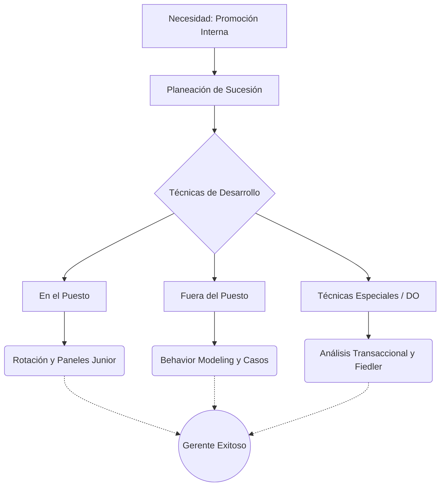

# 📈 Desarrollo de Gerentes: Técnicas y Sucesión

**Autor:** Gary Dessler - Unidad 3
**Tema:** Desarrollar gerentes es un negocio multimillonario para las empresas, impulsado por una realidad: el 90% de los supervisores y el 51% de los altos ejecutivos son promovidos internamente. Para que no fracasen al ascender, la empresa debe planificar su desarrollo meticulosamente.

---

## 🧭 La Planeación de Sucesión

Antes de capacitar, hay que predecir el futuro corporativo. El departamento de recursos humanos debe realizar proyecciones de expansión y diseñar **Diagramas de Reemplazo**: mapas visuales que muestran a los candidatos internos potenciales para ocupar las sillas de la alta dirección, señalando qué cursos o rotaciones necesitan hoy para estar listos mañana.

---

## 🛠️ Técnicas de Desarrollo: En el Puesto vs Fuera del Puesto

Dessler clasifica las metodologías de entrenamiento en dos grandes mundos. El 68% de las empresas prefiere las herramientas **dentro del puesto**:

> [!NOTE]
> **En el Puesto de Trabajo**
> - **Rotación de Puestos:** Mover al gerente junior por distintas áreas (finanzas, ventas, operaciones). Evita el estancamiento y crea "generalistas" con visión global (Ej. rotación global en Shell).
> - **Action Learning (Aprendizaje en Acción):** Sacar a un gerente competente de su área para que trabaje a tiempo completo resolviendo un problema real en otro departamento (o incluso en una agencia del Estado).
> - **Paneles Junior (Junior Boards):** Dar a gerentes medios la oportunidad de sentarse a resolver problemas corporativos reales, como si fueran el Directorio de la empresa.

> [!TIP]
> **Fuera del Puesto de Trabajo**
> - **Juegos Gerenciales:** Simulaciones computarizadas donde equipos compiten comprimiendo años de mercado en semanas.
> - **Método de Casos:** Diagnosticar problemas organizacionales reales en grupo. La regla de oro: rara vez hay respuestas absolutas y el instructor no debe dar su solución preferida.
> - **Behavior Modeling (Modelo de Comportamiento):** Proceso de 4 pasos para enseñar habilidades interpersonales: 1) Ver un *Modelo* en video actuando bien; 2) *Interpretación* (Juego de roles); 3) *Refuerzo* social (Feedback); 4) *Transferencia* al trabajo real.

---

## ⚠️ Técnicas Especiales y Desarrollo Organizacional (DO)

Cuando el problema no es técnico sino de "actitud", se aplican metodologías psicológicas y estructurales:

> [!IMPORTANT]
> **1. Análisis Transaccional (AT)**
> Clasifica la comunicación del gerente en tres egos: *Padre* (dictatorial), *Niño* (emocional/berrinche) y *Adulto* (lógico). El objetivo es que los gerentes aprendan a operar siempre desde el "Adulto".

> [!WARNING]
> **2. Adecuación de la Situación (Fiedler)**
> Fiedler descubrió que es casi imposible cambiar la personalidad inherente de un líder. Por lo tanto, en lugar de intentar cambiar su estilo, la empresa debe entrenarlo para "modificar la situación" (ej. pedir más autoridad o cambiar la estructura de su equipo) para que se adecúe a su estilo natural.

> [!NOTE]
> **3. Desarrollo Organizacional (DO)**
> Son programas impulsados por un consultor (agente de cambio) basados en encuestas masivas, "formación de equipos" (Team Building) y, en casos extremos, los controvertidos "T-groups" (entrenamiento de sensibilidad con enfrentamientos psicológicos francos).

---

## 💼 Ejemplo Real Práctico: El Árbol de Vroom-Yetton

> [!TIP]
> **Caso Práctico: ¿Soy Autocrático o Participativo?**
> Un gerente tiene que decidir si comprar un software nuevo. No sabe si imponer su decisión o debatirla con su equipo. Aplica la técnica **Vroom-Yetton**, un "árbol de decisiones" basado en 7 preguntas clave.
> 1. ¿Es importante la calidad de la decisión? (Sí).
> 2. ¿Tengo yo toda la información? (No, mi equipo de IT sabe más).
> 3. ¿El problema está estructurado? (No).
> Al seguir el árbol de Vroom-Yetton, la herramienta le diagnostica científicamente que para este problema específico, la decisión *debe* ser consensuada en grupo. Elimina la intuición y aplica racionalidad al liderazgo.

---

## 📊 Síntesis Visual de Capacitación

