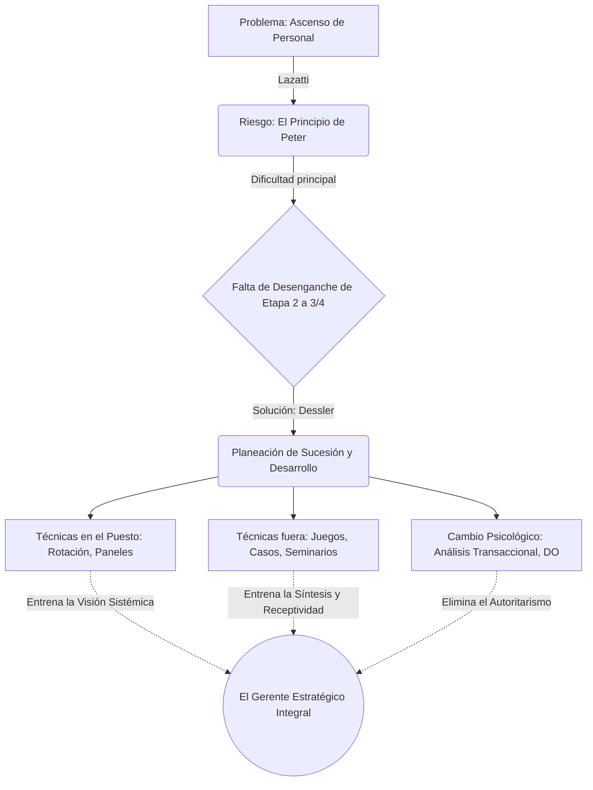

# 🌐 Infografía Integradora: Unidad 3

**Tema:** La Forja del Talento y la Evolución Gerencial
**Autores:** Santiago Lazatti, Gary Dessler

La Unidad 3 aborda el ciclo vital del "Desarrollo Gerencial". Nos muestra que el talento directivo no es espontáneo, sino el resultado de un riguroso proceso de planificación corporativa (Dessler) y de una profunda y muchas veces dolorosa evolución psicológica del individuo a través de su carrera (Lazatti).

---

## 🔗 Cómo se enlazan los Autores

> [!NOTE]
> **1. El Diagnóstico Evolutivo (Lazatti)**
> Lazatti nos otorga la "psicología" del desarrollo. Explica que la carrera de un individuo atraviesa 4 Etapas (Operativa, Técnica, Gerencial y Estratégica). El obstáculo supremo es el "desenganche": el profesional tiene que aprender a soltar lo técnico y empezar a manejar información y humanos. Lazatti advierte que si una empresa toma a alguien con enorme "Capacidad Analítica" (excelente en la Etapa 2) y lo asciende sin más a la Etapa 3 o 4, lo condena a sufrir el *Principio de Peter* (incompetencia), porque en la cima lo que importa es la Visión Sistémica, la Receptividad y el Liderazgo (Condiciones A y C).

> [!IMPORTANT]
> **2. La Solución Estructural (Dessler)**
> Dessler toma el diagnóstico de Lazatti y nos provee la "ingeniería de recursos humanos" para solucionarlo. Si sabemos que ascender ciegamente causa incompetencia, ¿cómo lo evitamos? A través del **Desarrollo de Gerentes** y la **Planeación de Sucesión**. Dessler estructura cómo la empresa debe entrenar proactivamente a sus empleados *antes* de que asuman la nueva etapa.

> [!TIP]
> **3. La Síntesis: Entrenamiento Dirigido para cada Etapa**
> El modelo de Dessler ofrece las herramientas exactas para curar los problemas de Lazatti.
> - Si el empleado está en la *Etapa Técnica* (Lazatti) y necesita pasar a la Gerencial, Dessler propone usar **"Rotación de Puestos"** o **"Action Learning"** para sacarlo de su visión de túnel y darle capacidad de síntesis.
> - Si el directivo sufre de "Problemas de Empuje" y autoritarismo en la *Etapa Estratégica* (Lazatti), Dessler aplica el **"Análisis Transaccional"** para eliminar sus berrinches de ego "Niño", o usa técnicas de **"Behavior Modeling"** para enseñarle receptividad y habilidades sociales críticas.

---

## 💼 Ejemplo Real Práctico: El Ingeniero y el Consultor

> [!TIP]
> **Caso Práctico: Salvando el Talento Interno**
> Una multinacional automotriz planea que Javier (su Ingeniero Jefe de Motores) sea el próximo Director General de la planta en 3 años.
> 1. **La Advertencia (Lazatti):** Javier es brillante en la Etapa 2 (Técnica) por su Vocación. Pero si lo ascienden hoy a Director General (Etapa 4), destruirá el clima laboral porque tiene exceso de empuje y nula Visión Sistémica del negocio comercial.
> 2. **La Intervención (Dessler):** Recursos Humanos activa su *Diagrama de Reemplazo* y Planeación de Sucesión. Deciden no ascenderlo todavía y aplicarle desarrollo corporativo.
> 3. **Las Técnicas:** Someten a Javier a **"Juegos Gerenciales"** (simulaciones computarizadas de mercado) para que adquiera Visión Sistémica. Luego, para mejorar su "Capacidad Social" y receptividad (Lazatti), utilizan la técnica de **"Vroom-Yetton"** para que aprenda científicamente cuándo debe ser participativo con los operarios y dejar de ser un líder autocrático.
> 4. *Resultado:* En 3 años, el ingeniero ha realizado su "desenganche" exitosamente y asume la Dirección General sin fracasar.

---

## 📊 Síntesis Visual Integradora

