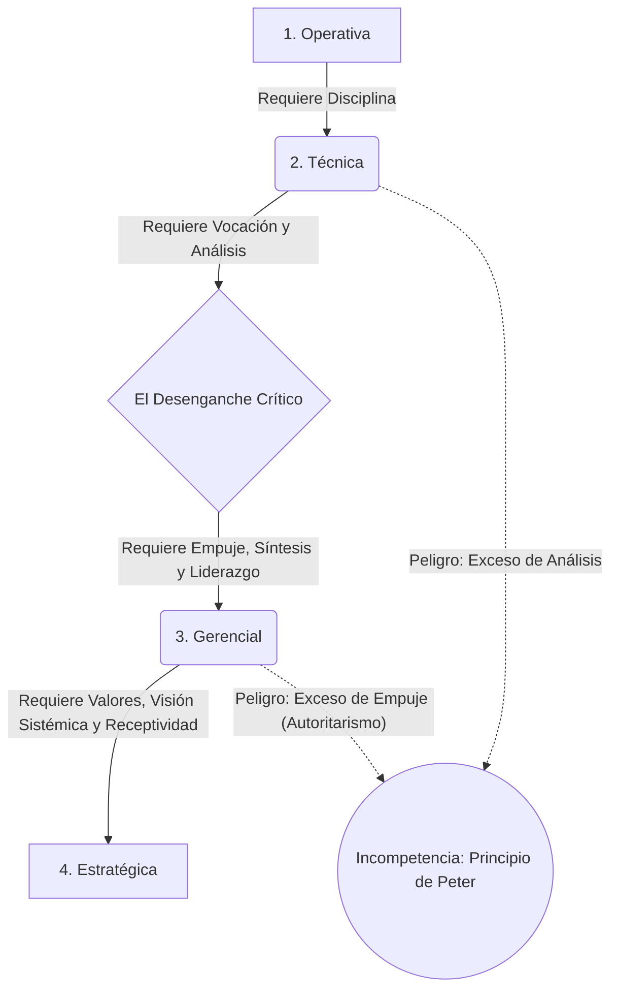

# 🧗‍♂️ Etapas del Desarrollo Gerencial

**Autor:** Santiago Lazatti - Unidad 3
**Tema:** El desarrollo gerencial exige un doloroso "desenganche". Ningún individuo tiene capacidad ilimitada para operar "las cosas" por sí mismo. Para ascender en la pirámide, el empleado debe soltar lo técnico y aprender a lograr resultados a través de la mente y las manos de los demás.

---

## 🧠 El Modelo ABC (Las 3 Condiciones Personales)

Para entender cómo evoluciona un gerente, Lazatti postula que todos usamos tres dimensiones, cuya importancia cambia en cada etapa:
- **[A] Fuerzas Vitales:** El motor interno. Valores, vocación, disciplina, empuje y motivaciones profundas.
- **[B] Capacidad Intelectual:** Cómo procesamos, analizamos y sintetizamos la información.
- **[C] Capacidad Social:** La destreza para el liderazgo y las relaciones interpersonales.

---

## 🧗‍♂️ Las 4 Etapas Evolutivas

El individuo atraviesa cuatro fases. Ascender requiere habilidades *nuevas*, no solo perfeccionar las anteriores.

> [!NOTE]
> **1. Etapa Operativa (La Base)**
> Tareas simples y rutinarias. Se requiere [A] Disciplina horaria, [B] Comprender rutinas básicas y [C] Mínima aptitud de comunicación.

> [!IMPORTANT]
> **2. Etapa Técnica (El Especialista)**
> Profesionales específicos (ej. un contador junior). Requiere [A] **Vocación** pura por lo que hace, [B] **Capacidad Analítica** fuerte para resolver problemas lógicos y [C] Mayor interacción con otras áreas.

> [!TIP]
> **3. Etapa Gerencial (El Jefe de Equipo)**
> Aquí ocurre el quiebre estructural: la persona pasa a tener gente a su cargo en escenarios ambiguos. Necesita [A] **Empuje** enorme para tomar iniciativa, [B] **Capacidad de Síntesis** y juicio crítico (el análisis puramente lógico ya no basta) y [C] **Liderazgo Básico**.

> [!WARNING]
> **4. Etapa Estratégica (La Cúspide Directiva)**
> La asignación global de recursos de la empresa. Exige la máxima madurez:
> - [A] **Valores Inquebrantables:** Tolerancia a la frustración y el "Tira y Afloja" simultáneo (dar autonomía al equipo mientras se mantiene el control, basado en la confianza).
> - [B] **Visión Sistémica:** Evitar la "visión de túnel" departamental y entender cómo lo técnico y lo humano se retroalimentan.
> - [C] **Participación y Receptividad:** El autoritarismo es inaceptable aquí. Se debe saber escuchar, delegar políticamente y negociar.

---

## ⚠️ El Lado Oscuro: El Principio de Peter

Las fortalezas que te hicieron exitoso en el pasado pueden destruirte en el futuro si no te adaptas a la nueva etapa:

- 🧮 **Problemas con la Vocación:** El gerente que, por amor a su profesión (etapa técnica), sigue haciendo el trabajo operativo de sus subordinados, descuidando el management real.
- 🤖 **Problemas con la Capacidad Analítica:** Gerentes brillantes que se estancan en la "parálisis por el análisis". Exigen a sus empleados que se comporten como máquinas lógicas, ignorando por completo la motivación psicológica humana.
- 🌋 **Problemas con el Empuje:** El empuje es vital en la etapa 3, pero en la etapa Estratégica (4) se vuelve un veneno. Los directores con "exceso de empuje" se vuelven impacientes, agresivos y egocéntricos. Como no saben "receptividad" (escuchar), destruyen a su equipo directivo.

---

## 💼 Ejemplo Real Práctico: El Analista Ascendido

> [!TIP]
> **Caso Práctico: El Síndrome del Supertécnico**
> Lucas era el mejor programador de la empresa (Etapa Técnica). Su código era perfecto gracias a su tremenda **[B] Capacidad Analítica** y su inmensa **[A] Vocación**. Lo ascienden a Gerente del Departamento (Etapa Gerencial).
> *El Problema:* Lucas no pudo hacer el "desenganche". En lugar de aplicar **[B] Síntesis** y **[C] Liderazgo Básico** para guiar a los programadores junior, Lucas se encierra en su oficina a revisar línea por línea el código de todos, cayendo en la *parálisis por análisis*.
> **Conclusión de Lazatti:** Promover a un excelente técnico sin entrenarlo en las capacidades C (Sociales) y B (Síntesis) requeridas para su nueva etapa, es forzarlo directamente hacia su propio nivel de incompetencia (Principio de Peter).

---

## 📊 Síntesis Visual Evolutiva

