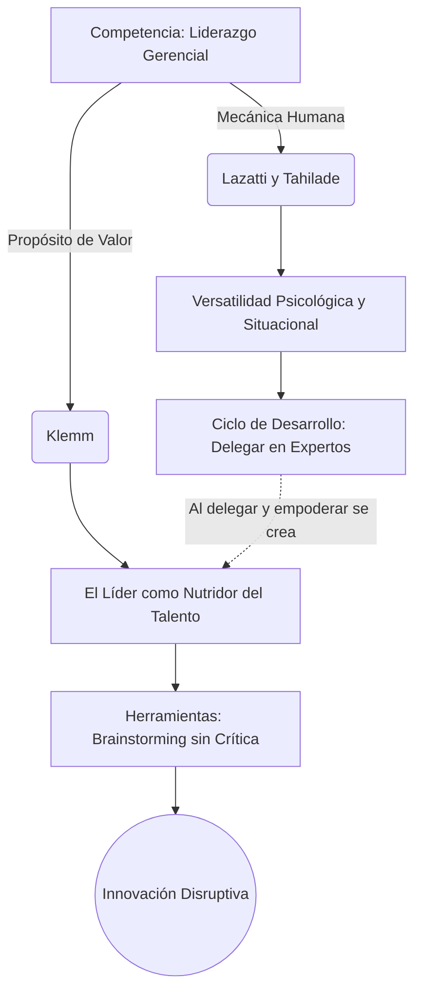

# 🌐 Infografía Integradora: Unidad 4

**Tema:** El Liderazgo: De la Gestión Humana a la Innovación
**Autores:** Lazatti y Tahilade, William Klemm

La Unidad 4 aborda la competencia más crítica de cualquier gerente: el Liderazgo. Sin embargo, nos muestra que "liderar" es un concepto compuesto que exige tanto un dominio táctico y psicológico sobre los individuos, como una visión estratégica para crear entornos donde nazca el futuro.

---

## 🔗 Cómo se enlazan los Autores

> [!NOTE]
> **1. La Mecánica y Versatilidad del Liderazgo (Lazatti y Tahilade)**
> Lazatti y Tahilade nos explican *cómo* funciona la maquinaria del liderazgo. Nos enseñan que la autoridad formal quedó obsoleta y fue reemplazada por el "Poder Personal". El gerente moderno debe poseer **Versatilidad** (Ponte y Gazia) para oscilar entre enfocarse en la "Tarea" o en la "Gente", y evitar rasgos destructivos como la **Dominancia** extrema (Ron Warren). A través del **Liderazgo Situacional** (Hersey), el líder ajusta su comportamiento empujando a los empleados hacia el Nivel 4 de madurez (Ciclo de Desarrollo) para poder delegar con total confianza y liberar su propio tiempo.

> [!IMPORTANT]
> **2. El Propósito Creador (Klemm)**
> Una vez que el líder dominó la mecánica humana (Lazatti) y logró que su equipo alcance el nivel máximo de madurez y autonomía, **Klemm** nos dice *para qué* usar ese equipo empoderado. Klemm postula que el líder no debe ser el "genio solitario" que inventa todo; en cambio, debe aplicar herramientas formales como **La Imaginación Aplicada** (A.F. Osborn) y el **Brainstorming** (sin crítica prematura) para transformar a ese equipo altamente maduro en una usina de ideas. El líder debe "nutrir" estas visiones para que no queden perdidas "en la frontera" (*Lost at the Frontier*).

> [!TIP]
> **3. La Síntesis: El Nutridor Situacional**
> El gerente que diagnostica a su equipo como "Experto" (Nivel 4 de Lazatti) decide delegar operativamente en ellos. Al usar la delegación (Lazatti) como un escudo contra la asfixia burocrática, logra forjar exactamente el "clima psicológico y social seguro" (Klemm) que la mente humana necesita para fusionar el pensamiento racional con el imaginativo, dando nacimiento a la innovación comercial.

---

## 💼 Ejemplo Real Práctico: Salvando una Empresa Tecnológica

> [!TIP]
> **Caso Práctico: Del Micromanagement a la Innovación**
> Una empresa de desarrollo de Apps pierde clientes porque sus productos son repetitivos.
> 1. El Director realiza un diagnóstico psicológico (**Lazatti**): nota que sufre de **Dominancia** (necesidad de control absoluto) y usa un liderazgo autocrático.
> 2. Decide cambiar y aplica el **Liderazgo Situacional (Lazatti)**: se da cuenta de que sus programadores son muy maduros y comprometidos (Nivel 4), por lo que transita hacia un Ciclo de Desarrollo y les otorga delegación total.
> 3. Con su equipo ahora empoderado, el Director asume el rol de **Líder Creativo (Klemm)**. Implementa la metodología de **Brainstorming de Osborn**, donde los programadores dan ideas locas sin temor a ser despedidos.
> 4. El Director "nutre" la mejor de estas ideas y, en lugar de dejarla *Lost at the Frontier*, lidera la gestión del cambio organizacional para lanzar una nueva App disruptiva que recupera el liderazgo del mercado.

---

## 📊 Síntesis Visual Integradora

