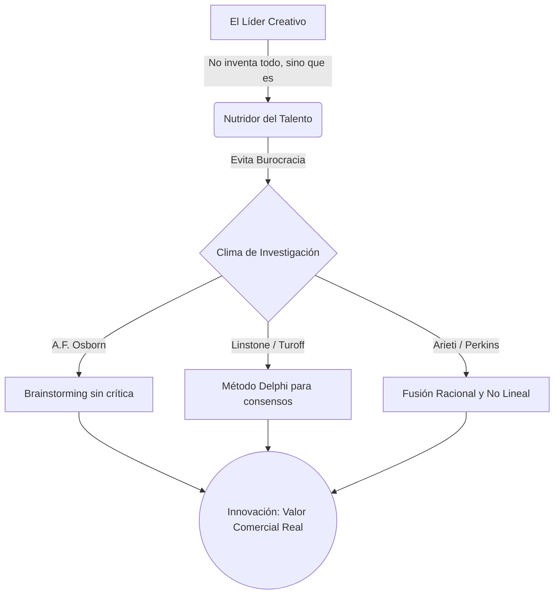

# 💡 Liderazgo Creativo e Innovación

**Autor:** William Klemm - Unidad 4
**Tema:** En un mundo turbulento, administrar lo existente garantiza la quiebra. El líder moderno debe superar la gestión rutinaria y forjar intencionalmente un "clima productivo" que estimule la mente de sus seguidores para transformar ideas locas en valor real.

---

## 🧭 La Anatomía de la Creatividad

Klemm dictamina que **el líder no tiene que ser el genio solitario que genera todas las ideas**. Su trabajo principal es actuar como un "nutridor": debe detectar las buenas ideas en su equipo, protegerlas de la burocracia y ayudarlas a madurar para que rindan fruto.

Para lograr esto, Klemm se basa en la psicología de la creatividad:
> [!NOTE]
> **La Síntesis Mágica (Arieti) y el Trabajo de la Mente (Perkins)**
> La creatividad no es un "evento aleatorio" ni un acto de magia instantáneo. Es un proceso metódico donde convergen dos fuerzas: el **pensamiento racional** (lógico) y el **pensamiento no lineal** (imaginativo). El gerente debe estimular organizativamente ambas áreas de la mente de sus colaboradores.

---

## 🛠️ Herramientas para la Innovación Colectiva

El líder debe evitar a toda costa que las innovaciones de su empresa queden "a la deriva" o perdidas en la frontera de las ideas abstractas que nunca se aplican comercialmente (*Lost at the Frontier*). Para extraer este valor intelectual y volverlo práctico, debe aplicar metodologías formales:

> [!IMPORTANT]
> **1. La Imaginación Aplicada (A. F. Osborn)**
> Es la fundamentación científica del *Brainstorming* (lluvia de ideas). El líder diseña un espacio donde el equipo genera alternativas masivas con una regla de oro: **está prohibida la crítica prematura**. Juzgar o castigar el error durante esta fase ahoga la toma de riesgos.

> [!TIP]
> **2. El Método Delphi (Linstone y Turoff)**
> Técnica de prospección y toma de decisiones a futuro. El líder busca consensos consultando sistemáticamente a expertos aislados, permitiendo a la organización adelantarse a escenarios desconocidos.

---

## 💼 Ejemplo Real Práctico: El Peligro de "Lost at the Frontier"

> [!TIP]
> **Caso Práctico: El Laboratorio Cautivo de la Burocracia**
> Una empresa farmacéutica tiene científicos brillantes que todos los días tienen ideas revolucionarias. Sin embargo, el Gerente del laboratorio es extremadamente rígido y burocrático: exige que cualquier experimento nuevo tenga primero 15 páginas de justificación financiera.
> *El Resultado:* Los científicos se agotan, dejan de intentar cosas nuevas y sus ideas quedan "Perdidas en la frontera" (Lost at the Frontier).
> *La Solución de Klemm:* Se reemplaza al Gerente por un **Líder Creativo**. Este nuevo líder no inventa ninguna medicina, pero utiliza **La Imaginación Aplicada**. Permite a los científicos dedicar los viernes por la tarde a experimentos libres sin llenar ningún formulario (anulando la crítica prematura). De este *clima productivo*, nace el medicamento más vendido de la década.

---

## 📊 Síntesis Visual

