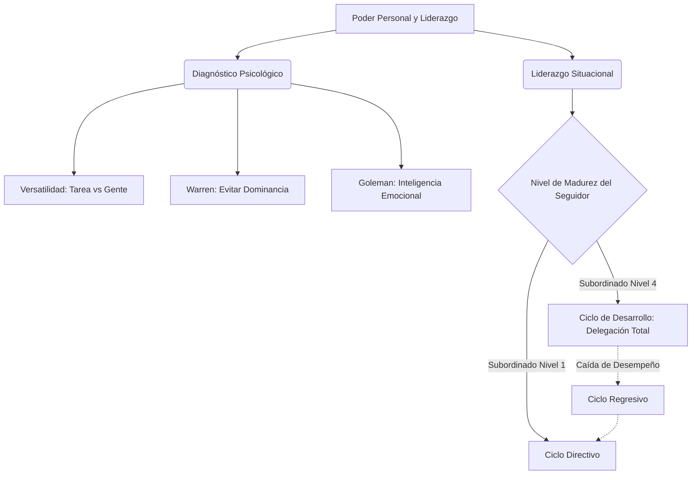

# 🤝 Liderazgo Gerencial: Teorías y Aplicación

**Autores:** Santiago Lazatti y Matías Tahilade - Unidad 4
**Tema:** La "autoridad formal" (el título de jefe) está muerta. Hoy rige el "poder personal" (la esencia del liderazgo). Los autores definen al liderazgo como la capacidad suprema de conseguir que los demás hagan lo que el líder desea que lleven a cabo, adaptándose científicamente al contexto.

---

## 🧭 Modelos de Análisis del Comportamiento

Para gerenciar grupos humanos, Lazatti y Tahilade recopilan los modelos psicológicos más efectivos:

> [!NOTE]
> **1. Inteligencia Emocional (Daniel Goleman)**
> Existen 6 estilos (visionario, entrenador, asociativo, democrático, coercitivo, el que marca la pauta). Un líder completo sabe pivotar entre ellos según la necesidad emocional del equipo.

> [!IMPORTANT]
> **2. Las 4 Miradas (Ponte y Gazia)**
> La atención del líder se divide en dos ejes: *Estratégico vs. Operativo* y *Tarea vs. Gente*. El líder no puede estancarse en uno solo; necesita **Versatilidad** (destreza para moverse flexiblemente de un eje a otro según la emergencia).

> [!WARNING]
> **3. La Personalidad en el Trabajo (Ron Warren)**
> Warren identifica rasgos positivos como la *Inteligencia Social* (apertura al feedback y cooperación) y el *Empuje*. Pero advierte sobre los rasgos destructivos ("Derailers"): la **Dominancia** (hostilidad, rigidez, necesidad de control absoluto) y la **Deferencia** (búsqueda excesiva de aprobación que paraliza las decisiones).

---

## 🛠️ El Modelo Definitivo: Liderazgo Situacional

Basado en Hersey y Blanchard, decreta que **no existe el estilo perfecto**. La delegación depende absolutamente de la madurez técnica y el compromiso del subordinado.

- **Ciclo de Desarrollo:** El objetivo estratégico del líder es que su seguidor aprenda progresivamente hasta alcanzar el *Nivel 4* (alta competencia y alto compromiso). Lograr esto permite "Delegar" completamente, liberando el tiempo del líder para tareas superiores.
- **Ciclo Regresivo:** Si un empleado experto súbitamente decae en su desempeño (por desmotivación o problemas personales), el líder debe retroceder y aplicar un estilo "Directivo" (de control estricto) temporalmente hasta recuperarlo.

---

## ⚙️ La Participación y el Empowerment

Lazatti y Tahilade separan la comunicación de las reuniones en dos dimensiones:
- **El Contenido (El "Qué"):** Las ideas, la información y las conclusiones (la carne de la reunión).
- **El Proceso (El "Cómo"):** La dinámica de la interacción.
El gerente moderno actúa como **Facilitador del Proceso**, promoviendo el *Empowerment* (empoderamiento) para que los colaboradores aporten al "Contenido" estratégico, siempre respaldado por un sistema de recompensas justas.

---

## 💼 Ejemplo Real Práctico: El Ciclo de Desarrollo y Regresión

> [!TIP]
> **Caso Práctico: El Jefe de Contabilidad y el Error Fatal**
> **Escenario 1:** Laura es Analista Junior. El gerente (usando Liderazgo Situacional) aplica un estilo **Directivo** (le enseña paso a paso cómo cargar facturas). 
> **Escenario 2:** Tras dos años, Laura se vuelve experta (Nivel 4). El gerente aplica su **Versatilidad** y cambia a un estilo de **Delegación**, dándole total libertad para cerrar los balances. Esto libera el tiempo del gerente (Ciclo de Desarrollo).
> **Escenario 3:** Laura sufre un divorcio, se distrae y comete errores financieros millonarios. El gerente se da cuenta de la caída, aplica el **Ciclo Regresivo** y suspende temporalmente la delegación, volviendo a un estilo más directivo y asociativo para revisar su trabajo de cerca hasta que Laura recupere su concentración y madurez.

---

## 📊 Síntesis Visual del Liderazgo Gerencial

