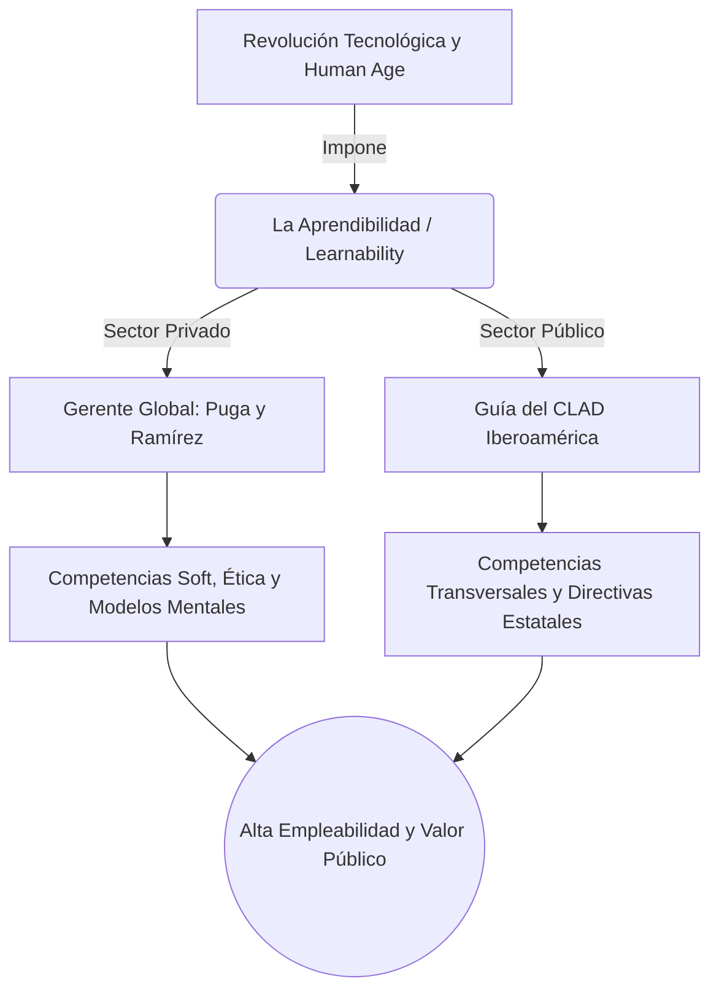

# 🌐 Infografía Integradora: Unidad 5

**Tema:** La Revolución de las Competencias en la Era Humana
**Autores:** AulaGlobal, Puga y Martínez, Ramírez, ManpowerGroup (Human Age), CLAD.

La Unidad 5 nos sumerge en el clímax del Desarrollo Gerencial moderno. La automatización, la globalización y la caída del paradigma del "empleo para toda la vida" han forzado tanto al sector privado como al público a gestionar a su personal bajo un enfoque radical: **El Modelo de Competencias Laborales**.

---

## 🔗 La Matriz Teórica de la Unidad 5

> [!NOTE]
> **1. La Evolución: Del IQ a la Empleabilidad (AulaGlobal y Human Age)**
> El antiguo modelo contrataba en base al "Expediente Académico" (*Competencias Hard* / Técnicas). Hoy, **AulaGlobal** demuestra, basándose en McClelland y Goleman, que el éxito de un gerente depende de su Inteligencia Emocional (*Competencias Soft*). 
> **ManpowerGroup (Human Age)** redobla esta apuesta: La tecnología automatizará lo rutinario. La supervivencia ya no es tener "seguridad laboral", sino **Empleabilidad** (mantener tus competencias actualizadas). La habilidad suprema de esta Revolución es la **Aprendibilidad (Learnability)**: tu agilidad mental para aprender competencias nuevas para trabajos que hoy ni siquiera existen.

> [!IMPORTANT]
> **2. Las Herramientas del Gerente Privado (Puga y Ramírez)**
> Para lograr esa "Aprendibilidad", el gerente global no puede ser un autócrata. **Puga y Martínez** exigen que use un *Enfoque Sistémico* aplicando su "Pentágono": Liderazgo, Comunicación, Ética, Trabajo en Equipo y, sobre todo, **Orientación al Conocimiento**. 
> ¿Cómo se orienta el conocimiento? **Luz Marina Ramírez** responde dándonos pedagogía gerencial: aplicando *Pensamiento Sistémico*, cultivando el *Feedback* (Retroalimentación) y utilizando Metacognición para cambiar nuestros **Modelos Mentales** caducos ("vaciando nuestra habitación mental").

> [!TIP]
> **3. La Aplicación en el Estado (El Modelo del CLAD)**
> Esta revolución no perdona a los gobiernos. El **CLAD** diseña un *Diccionario de Competencias* deductivo y estandarizado para toda Iberoamérica. Se exige:
> - **Competencias Transversales** (para todos): Aprendizaje continuo, ética.
> - **Competencias Directivas:** Gestión de resultados y conducción del cambio.
> - **Competencias Profesionales:** Aporte técnico y manejo de herramientas tecnológicas (TIC).
> Todo esto implementado a través de una *Hoja de Ruta* de sensibilización institucional para democratizar el Estado y crear Valor Público.

---

## 💼 Ejemplo Real Práctico: El Choque Generacional

> [!TIP]
> **Caso Práctico: El Abogado vs La Inteligencia Artificial**
> Martín es un brillante analista jurídico en un Ministerio (Sector Público - **CLAD**). Sus *Competencias Hard* (leyes) son excelentes, pero carece de *Aprendibilidad* (**Human Age**). 
> El Estado compra un sistema de Inteligencia Artificial que redacta los expedientes rutinarios que Martín hacía en horas, en tan solo segundos.
> - **El Diagnóstico:** Martín tiene pánico de perder su trabajo porque su *Modelo Mental* (**Ramírez**) ve el cambio como amenaza.
> - **La Solución:** La Directora del área, utilizando sus *Habilidades Blandas* y de Comunicación (**Puga**), ejerce un liderazgo empático. Le enseña a Martín a usar la I.A., transformando su rol. Ahora, Martín no redacta (lo hace la máquina), sino que aplica "Pensamiento Crítico" y "Gestión de Vínculos" con los ciudadanos, elevando su **Empleabilidad** y aportando un inmenso Valor Público al Ministerio gracias a su reconversión.

---

## 📊 Síntesis Visual Integradora

