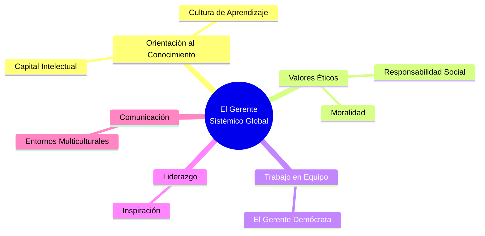

# 🌍 El Pentágono del Director Global

**Autores:** Puga Villarreal y Martínez Cerna - Unidad 5
**Tema:** La alta dirección frente a la globalización. Las destrezas mecánicas han quedado obsoletas; el líder que toma decisiones en la cúpula hoy compite mediante "Habilidades Blandas".

---

## 🧭 El Diagnóstico: El Fin del Capital Fijo

Los autores diagnostican que el mundo de los negocios abandonó el esquema basado en activos fijos (quien tiene más dinero o fábricas). La nueva competencia global se sustenta exclusivamente en **activos intangibles (El Capital Intelectual)**. Ante esto, el directivo verticalista y controlador del pasado es un peligro para la organización. Debe transformarse en un "capacitador" para el desarrollo de su equipo.

---

## 🛠️ Las 5 Competencias Esenciales (El Pentágono)

De su investigación de campo, los autores extraen las cinco Habilidades Blandas transversales que todo directivo global debe dominar (ya sea en el Estado o en una Multinacional):

> [!NOTE]
> **1. Orientación al Conocimiento**
> El líder ya no controla procesos; *maneja el intelecto humano*. Su trabajo es instaurar una "cultura de aprendizaje" para dotar a los empleados de herramientas cognitivas que los mantengan vigentes.

> [!IMPORTANT]
> **2. Valores Éticos y RSE**
> El gerente no opera en un vacío moral. Debe equilibrar la rentabilidad con el respeto al entorno y a la comunidad. (Citan el ejemplo de la gerencia china basada en el confucionismo: la moralidad a largo plazo rinde mucho más que la técnica).

> [!TIP]
> **3. Trabajo en Equipo**
> El "autócrata centralista" murió. Nace el "gerente demócrata". Hoy se evalúa a un director no por su brillantez individual, sino por su capacidad para construir sinergias en grupo desde su autoridad humana, no desde la imposición de su cargo.

> [!WARNING]
> **4. Liderazgo y 5. Habilidades de Comunicación**
> El pentágono se cierra con la capacidad estratégica de inspirar en tiempos turbulentos y la habilidad de decodificar y transmitir la realidad en equipos multiculturales complejos.

---

## 🧩 El Enfoque Sistémico

El gran aporte de Puga y Martínez es advertir que **estas competencias no son una "lista de compras"**.
Deben comprenderse bajo un **Enfoque Sistémico**: se retroalimentan constantemente. Un directivo con gran conocimiento (1) pero sin ética (2) es destructivo. Un buen comunicador (5) sin capacidad de trabajo en equipo (3) es un demagogo inútil. Solo la integración armónica garantiza la competitividad en escenarios globales.

---

## 📊 Síntesis Visual del Directivo Global

