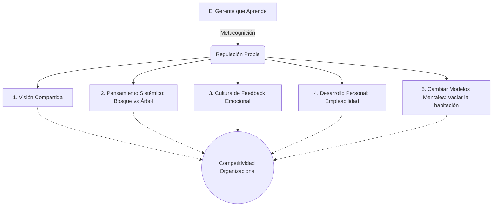

# 🧠 Estrategias de Desarrollo y Modelos Mentales

**Autora:** Luz Marina Ramírez - Unidad 5
**Tema:** ¿Cómo hace un gerente para forjar competencias? A través del Aprendizaje Organizacional y la pedagogía gerencial. El error no es fracaso, es una oportunidad de mejora indispensable para sobrevivir.

---

## 🧭 Las 5 Estrategias Formativas (Basado en Peter Senge)

La autora adapta las disciplinas de la "Organización que Aprende" en 5 herramientas de aplicación directa para el gerente:

> [!NOTE]
> **1. Desarrollo de una Visión Compartida**
> Romper la miopía gerencial. Si el líder comunica sus sueños y el norte lógico de la empresa, logra que el equipo trabaje en consenso. Exige alta participación y definir claramente los *Factores Críticos de Éxito*.

> [!IMPORTANT]
> **2. El Pensamiento Sistémico**
> El error fatal de los gerentes es "ver el árbol y no el bosque". Esta estrategia exige superar la fragmentación departamental y comprender a la empresa como un ente donde cada decisión local tiene un impacto macro (configuraciones relacionales).

> [!TIP]
> **3. Trabajar en Equipo y la Cultura del Feedback**
> La sinergia y el diálogo. Se sostiene en el **Feedback (Retroalimentación)**: devolver información descriptiva, específica y oportuna al empleado sobre su actuar. Exige "Gestión Emocional": validar los sentimientos del otro sin deteriorar la relación laboral para generar una mejora continua.

> [!WARNING]
> **4. El Desarrollo Personal**
> *La regla de oro: "Solo tú limitas tu crecimiento"*. El gerente debe diseñar su propio Plan de Empleabilidad (riesgos, visión, misión). A veces, la mejor estrategia es ponerse en **posición de aprendiz** y observar cómo operan otros líderes.

> [!NOTE]
> **5. Identificación y Desarrollo de Modelos Mentales**
> *La metáfora de la Habitación:* "Cada mente es una habitación repleta de muebles viejos (paradigmas). Hay que vaciarla antes de meter algo nuevo". El gerente debe desechar hábitos antiguos y dejar de ver el cambio como "amenaza" para verlo como "oportunidad".

---

## ⚙️ El Motor de Cierre: Regulación Metacognitiva

Para que estas 5 estrategias no queden en la teoría, el gerente debe aplicar la **Regulación Metacognitiva**. Es una profunda reflexión autocrítica sobre "cómo funciona mi propia mente frente a un problema". A través de ella, el gerente logra autorregularse y entregar dos resultados claros frente a la adversidad: **La Solución y el Plan de Acción**.

---

## 💼 Ejemplo Real Práctico: Vaciando la Habitación

> [!TIP]
> **Caso Práctico: El Modelo Mental del Controlador**
> Un antiguo Jefe de Ventas asume la gerencia. Su *Modelo Mental* (sus gafas para ver la realidad) es de la vieja escuela: "A los empleados hay que medirlos solo por números (cuantitativo) y vigilar que no se relajen".
> Cuando las ventas caen, se enfurece. Aplica **Metacognición**: reflexiona y se da cuenta de que sus "muebles viejos" (micromanagement) están ahogando la proactividad del equipo.
> Decide *vaciar la habitación*: aplica la estrategia de **Cultura de Feedback** y descubre que los clientes quieren atención cualitativa. Cambia su enfoque, fomenta la comunicación en red (sinergia) y abandona el control asfixiante, logrando revertir la crisis.

---

## 📊 Síntesis Visual de Estrategias

